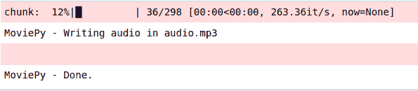

# 使用 Python 将视频转换为音频

> 原文:[https://www . geesforgeks . org/video-to-audio-convert-use-python/](https://www.geeksforgeeks.org/video-to-audio-convert-using-python/)

**先决条件:** [Python 编程语言](https://www.geeksforgeeks.org/python-programming-language/)

Python 中有几个库和技术可用于视频到音频的转换。一个这样的库是**电影编辑器**。

MoviePy 可以读写所有最常见的音频和视频格式，包括 GIF，并在 Windows/Mac/Linux 上运行，支持 Python 2.7+和 3(或仅支持 v.1.0 版的 Python 3.4+)

#### 装置

要安装**电影编辑器**库，打开终端并编写:

```
pip install moviepy

```

**注意:**本模块自动安装 FFmpeg。但是，在某些情况下，您可能会提示安装。

#### 安装 FFmpeg

**窗户:**

*   从[这里](https://ffmpeg.zeranoe.com/builds/)下载构建。
*   解压缩任何文件夹中的构建。
*   以管理权限打开 cmd
*   运行以下命令来设置环境变量。

    ```
    setx /M PATH "path\to\ffmpeg\bin;%PATH%"
    ```

**Linux:**

在终端中写下以下命令。

```
sudo add-apt-repository ppa:mc3man/trusty-media  
sudo apt-get update  
sudo apt-get install ffmpeg  
sudo apt-get install frei0r-plugins
```

**实施**

```
# Python code to convert video to audio
import moviepy.editor as mp

# Insert Local Video File Path 
clip = mp.VideoFileClip(r"Video File")

# Insert Local Audio File Path
clip.audio.write_audiofile(r"Audio File")
```

**输出:**

