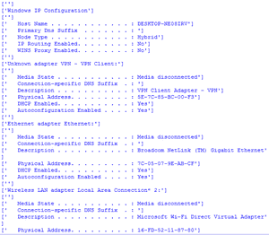
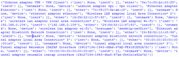

# 使用 Python 查看计算机的重要网络信息

> 原文:[https://www . geesforgeks . org/view-计算机-重要-网络-信息-使用-python/](https://www.geeksforgeeks.org/view-computers-important-network-information-using-python/)

在网络中工作时，我们会对网络或互联网问题进行一些故障排除。这次我们需要检查您自己的系统网络连接信息。

我们可以在 Windows 的控制面板中找到网络连接。找到这些信息的最好方法我们可以在 CMD 中使用 [**ipconfig**](https://www.geeksforgeeks.org/ifconfig-command-in-linux-with-examples/) 命令。当您使用 **ipconfig /all** 时，您可以获得足够的信息来解决您的网络问题。

示例:


**方法 1:**

我们将使用 [**子流程**](https://www.geeksforgeeks.org/python-subprocess-module-to-execute-programs-written-in-different-languages/) 模块与 cmd 交互，并将信息检索到您的 python ide 中。我们可以通过子流程模块读取 cmd 命令。

**进场:**

1.  导入模块
2.  使用 subprocess.check_output()获取命令“‘ipconfig’，“/all””的输出
3.  现在获取分割字符串，并根据自己的需要排列数据。

## 蟒蛇 3

```
# import module
import subprocess

# Traverse the ipconfig information
data = subprocess.check_output(['ipconfig','/all']).decode('utf-8').split('\n')

# Arrange the bytes data
for item in data:
     print(item.split('\r')[:-1])
```

**输出:**



**方法二:**

**Ifcfg** 模块是一个跨平台(Windows/Unix)库，用于解析 Python 中的 **ifconfig** 和 **ipconfig** 输出。它对于提取诸如 IP、网络掩码、媒体访问控制地址、主机名等信息非常有用。

**安装:**

```
pip install ifcfg

```

**实施:**

## 蟒蛇 3

```
import ifcfg
print(ifcfg.interfaces())
```

**输出:**

