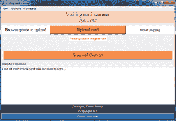
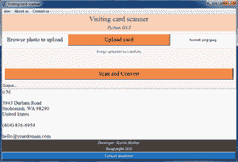

# 使用 Python 的名片扫描仪图形用户界面应用

> 原文:[https://www . geesforgeks . org/visit-card-scanner-GUI-application-use-python/](https://www.geeksforgeeks.org/visiting-card-scanner-gui-application-using-python/)

**Python** 是一种新兴的编程语言，由许多内置模块和库组成。它为许多 web 和敏捷应用程序提供支持。由于其简洁明了的语法行为，许多像 Instagram、网飞等大型知名组织都在 Python 工作框架中工作，并朝着宏伟的发展方向前进。在本文中，我们将使用 [Tkinter](https://www.geeksforgeeks.org/python-gui-tkinter/) 来构建用于扫描名片的图形用户界面应用程序。

Tkinter 是一个非常强大和用户友好的工具包，因为它为用户提供了修改 Tkinter 库中可用小部件的行为和属性的完全控制。因为 Tkinter 提供了一个面向对象的工作框架，所以它是一种更好的应用程序编程方式。Tkinter 中的面向对象接口满足 DRY(不要重复自己)原则，有助于减少代码的冗余。

需要复制库:

*   tkinter library
*   中小企业图书馆
*   [枕库](https://www.geeksforgeeks.org/python-pillow-a-fork-of-pil/)
*   [操作系统模块](https://www.geeksforgeeks.org/os-module-python-examples/)

上述图书馆简介:

*   **pytessert 库:**pytessert 是一个基于 ICR(智能字符识别)和 OCR(光学字符识别)的工具包，在 python 中可用。它是谷歌的一个包装工具，可以*【提取】**【读取】*任何图像中嵌入的文本。首先，在您的系统上安装并运行 Pytesseract，使用的是可用的 tesseract 设置 [**，这里是**](https://github.com/UB-Mannheim/tesseract/wiki) 。从上面的 Github 链接安装应用程序后，在外壳上安装 pytesseract

```
pip install pytesseract
```

*   **枕头套库:**它是一个免费的开源库，可用 Python 进行图像处理(操作、打开和关闭各种文件格式，即 jpeg/png)。

```
pip install Pillow
```

*   **Os 模块:**是处理程序与操作系统之间文件事务的交互模块。os.path 实用程序模块提供文件共享功能。

**程序方法:**

*   首先，我们将创建一个界面，即图形用户界面，使用 Tkinter 中可用的各种小部件和属性，如标签、按钮、框架等。
*   在创建了一个基本布局之后，我们现在准备通过实现它的主要功能(即上传一个文件，然后转换它)来使它具有响应性。
*   **文件对话框**框逻辑将在这里工作，以便正确格式化的图像可以上传到软件。
*   上传成功后，系统就可以进行转换了，现在**角色开始发挥作用。Pytesseract 模块将从图像中读取并提取嵌入的文本，并用转换后的文本更新文本区域。**
*   同样，python 中的**文件处理**方法将创建并附加一个带有转换文本的文本文件，并将它存储在我们系统的本地数据库中。
*   存储的文件可以在将来访问，用于信息和验证目的。

**以下是完整实现:**

## 蟒蛇 3

```
# Visiting Card scanner GUI

# imported tkinter library
from tkinter import *
import tkinter.messagebox as tmsg   

# Pillow library for importing images
from PIL import Image, ImageTk

# library for filedialog (For file selection)
from tkinter import filedialog

# Pytesseract module importing
import pytesseract       
import os.path

root = Tk()

# fixing geometry of GUI
root.geometry('800x500')       
root.maxsize(1000, 500)
root.minsize(600, 500)
root.title('Visiting card scanner')

# function for uploading file to GUI
def upload_file():       
    global filename
    global start, last
    filename = filedialog.askopenfilename(
        initialdir='/Desktop', title = 'Select a card image',
      filetypes=(('jpeg files', '*.jpg'), ('png files', '*.png')))

    if filename == '':
        t.delete(1.0, END)
        t.insert(1.0, 'You have not provided any image to convert')
        tmsg.showwarning(
            title = 'Alert!', message = 'Please provide proper formatted image')
        return

    else:
        p_label_var.set('Image uploaded successfully')
        l.config(fg='#0CDD19')

    if filename.endswith('.JPG') or filename.endswith('.JPEG') or filename.endswith('.jpg') or filename.endswith('.jpeg') or filename.endswith('.PNG') or filename.endswith('.png'):
        filename_rev = filename[::-1]
        last = filename.index('.')
        start = len(filename) - filename_rev.index('/') - 1

# function for conversion
def convert():       
    try:
        c_label_var.set('Output...')
        pytesseract.pytesseract.tesseract_cmd = r'C:\Program Files (x86)\Tesseract-OCR\tesseract'
        text = pytesseract.image_to_string(filename)
        t.delete(1.0, END)
        t.insert(1.0, text)
        root1 = Toplevel()
        root1.title('Uploaded image')
        img1 = ImageTk.PhotoImage(Image.open(filename))
        Label(root1, image=img1).pack()
        root1.mainloop()
    except:
        t.delete(1.0, END)
        t.insert(1.0, 'You have not provided any image to convert')
        tmsg.showwarning(
            title='Alert!', message='Please provide proper formatted image')
        return
    f_name = filename[start+1:last]+'.txt'
    f_name = os.path.join(r'Database', f_name)
    f = open(f_name, 'w')
    f.write(text)
    f.close()

# Menu bar and navigation tab creation
mainmenu = Menu(root)
mainmenu.config(font = ('Times', 29))

m1 = Menu(mainmenu, tearoff = 0)
m1.add_command(label = 'Scan/Upload Visiting or Business cards and get all the text of cards',
               font = ('Times', 13))
root.config(menu = mainmenu)
mainmenu.add_cascade(label = 'Aim', menu = m1)

m2 = Menu(mainmenu, tearoff = 0)
m2.add_command(label = '|| Electronics and Communication engineering student ||',
               font = ('Times', 13))
m2.add_command(label = '|| Coding Enthusiast ||', font = ('Times', 13))
root.config(menu = mainmenu)
mainmenu.add_cascade(label = 'About us', menu = m2)

m3 = Menu(mainmenu, tearoff=0)
m3.add_command(label = 'E-mail: mathurkartik1234@gmail.com',
               font = ('Times', 13))
m3.add_separator()
m3.add_command(label = 'Mobile: +91-9587823004', font=('Times', 13))
m3.add_separator()
m3.add_command(label = 'LinkedIn: https://www.linkedin.com/in/kartik-mathur-97a825160',
               font = ('Times', 13))
root.config(menu = mainmenu)
mainmenu.add_cascade(label = 'Contact us', menu = m3)

Label(text = 'Visiting card scanner', bg = '#FAD2B8',
      fg = '#39322D', font = ('Times', 18)).pack(fill = 'x')
Label(text = 'Python GUI', bg = '#FAD2B8', fg ='#39322D', font=(
    'Times New Roman', 12, 'italic')).pack(fill='x')

f1 = Frame()
f1.config(bg='white')
Label(f1, text='Browse photo to upload', width=20,
      font=('Times', 15), bg='white').pack(side='left')
Label(f1, text='format: png/jpeg', bg='white',
      width=30).pack(side='right', padx=5)
Button(f1, text='Upload card', bg='#F58D4B', font=('Times', 15),
       width=70, command=upload_file).pack(side='right')
f1.pack(pady=10, fill='x')
p_label_var = StringVar()
p_label_var.set('Please upload an image to scan')
l = Label(textvariable=p_label_var, fg='red', bg='white')
l.pack()

Label(text='©copyright 2020', bg='#433E3B', fg='white',
      font=('Times', 10)).pack(side='bottom', fill='x')
Label(text='Developer: Kartik Mathur', bg='#433E3B', fg='white',
      font=('Times', 10, ' italic')).pack(side='bottom', fill='x')
t = Text(root, height='9', font=('Times', 13))
t.pack(side='bottom', fill='x')
t.insert(1.0, 'Text of converted card will be shown here...', END)
c_label_var = StringVar()
c_label_var.set('Ready for conversion')
c_label = Label(textvariable=c_label_var)
c_label.pack(side='bottom', anchor='w')
Button(root, text='Scan and Convert', bg='#F58D4B', font=('Times', 15),
       width=70, command=convert).pack(pady='10', side='bottom')
root.mainloop()
```

**输出:**



名片扫描仪图形用户界面

上图描绘了应用程序界面。

### **如何使用，如何工作？**

*   用户可以扫描和上传两种格式的图像(即 jpeg、png)
*   点击“上传卡”，用户将登陆文件对话框，并可以选择需要转换的图像。
*   上传成功后，系统会提示图像上传成功。
*   现在用户可以通过点击“扫描并转换”按钮来转换它。
*   文本信息将显示在文本区域，转换后的文件将存储在内部数据库中。

**结果与分析:**

转换的准确率和效率都很高，所以推荐使用这个 pytesseract 库是一种非常高效的转换方式。

<figure class="table">

| 

Uploaded image

 | 

Image embedding text to plain text output

 |

</figure>