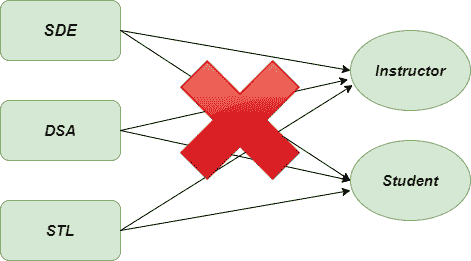

# 访客法——Python 设计模式

> 原文:[https://www . geesforgeks . org/visitor-method-python-design-patterns/](https://www.geeksforgeeks.org/visitor-method-python-design-patterns/)

访问者方法是一种 [**行为设计模式**](https://www.geeksforgeeks.org/design-patterns-set-1-introduction/) ，它允许我们将算法从它所操作的对象结构中分离出来。它帮助我们向现有的类层次结构中动态添加新的特性，而不改变它。所有的行为模式都被证明是处理对象之间通信的最佳方法。同样，当我们必须对一组相似类型的对象执行操作时，也会用到它。
访客法由两部分组成:

*   由访问者实现的名为 **Visit()** 的方法，用于并调用数据结构的每个元素。
*   提供接受访问者的 **Accept()** 方法的可访问类

### 设计组件

*   **客户端:**客户端类充当访问者设计模式的类的消费者。它可以访问数据结构对象，并可以指示它们接受访问者进行未来的处理。
*   **Visitor:** 一个抽象类，用于声明所有可访问类的访问操作。
*   **具体访客:**每个访客负责不同的操作。对于每种类型的访问者，必须实现抽象访问者中声明的所有访问方法。
*   **visible:**Accept 操作由这个类声明。它还作为一个入口点，使一个对象能够被访问者访问。
*   **具体的 visible:**这些类实现了 visible 类并定义了接受操作。使用接受操作将访问者对象传递给该对象。

### 不使用访问者方法的问题

想象一下你正在处理 **GeeksforGeeks** 的软件管理，他们已经开始了某些课程，比如 DSA、SDE 和 STL，这些课程对于准备进入基于产品的公司的学生来说肯定很有用。但是，您将如何处理数据库中的课程、教师、学生、班级、身份证的所有数据呢？如果你用一种简单直接的方法来处理这种情况，你最终肯定只会一团糟。



访客问题图

### 使用访问者方法的解决方案

让我们看看上述问题的解决方案。Visitor 方法建议在一个名为 Visitor 类的单独类中添加一个新行为，而不是将其与已经存在的类混合。我们将原始对象作为参数传递给访问者的方法，这样该方法将访问所有必要的信息。

## 蟒蛇 3

```py
""" The Courses hierarchy cannot be changed to add new
   functionality dynamically. Abstract Crop class for
 Concrete Courses_At_GFG classes: methods defined in this class
 will be inherited by all Concrete Courses_At_GFG classes."""

class Courses_At_GFG:

    def accept(self, visitor):
        visitor.visit(self)

    def teaching(self, visitor):
        print(self, "Taught by ", visitor)

    def studying(self, visitor):
        print(self, "studied by ", visitor)

    def __str__(self):
        return self.__class__.__name__

"""Concrete Courses_At_GFG class: Classes being visited."""
class SDE(Courses_At_GFG): pass

class STL(Courses_At_GFG): pass

class DSA(Courses_At_GFG): pass

""" Abstract Visitor class for Concrete Visitor classes:
 method defined in this class will be inherited by all
 Concrete Visitor classes."""
class Visitor:

    def __str__(self):
        return self.__class__.__name__

""" Concrete Visitors: Classes visiting Concrete Course objects.
 These classes have a visit() method which is called by the
 accept() method of the Concrete Course_At_GFG classes."""
class Instructor(Visitor):
    def visit(self, crop):
        crop.teaching(self)

class Student(Visitor):
    def visit(self, crop):
        crop.studying(self)

"""creating objects for concrete classes"""
sde = SDE()
stl = STL()
dsa = DSA()

"""Creating Visitors"""
instructor = Instructor()
student = Student()

"""Visitors visiting courses"""
sde.accept(instructor)
sde.accept(student)

stl.accept(instructor)
stl.accept(student)

dsa.accept(instructor)
dsa.accept(student)
```

### 输出

```py
SDE Taught by  Instructor
SDE studied by  Student
STL Taught by  Instructor
STL studied by  Student
DSA Taught by  Instructor
DSA studied by  Student
```

### UML 图

以下是访问者方法
的 UML 图


UML-图-访问者-方法

### 优势

*   **Open/Closed 原则:**在类中引入新的行为很容易，可以处理不同类的对象，而无需在这些类中进行更改。
*   **单一责任原则:**同一行为的多个版本可以操作到同一个类中。
*   **添加实体:**在**访客方法**中添加实体很容易，因为我们只需要在访客类中进行更改，不会影响现有的项目。
*   **更新逻辑:**如果操作的逻辑被更新了，那么我们只需要在访问者实现中进行更改，而不是在所有的项目类中进行更改。

### 不足之处

*   **大量更新:**每当一个类从主层次结构中被添加或移除时，我们必须更新每个访问者
*   **难以扩展:**如果访客类太多，那么扩展类的整个接口就变得非常困难。
*   **缺乏访问权限:**有时访问者可能无法访问他们应该使用的某些类的私有字段。

### 适应性

*   **递归结构:** Visitor 方法对于像目录树或 XML 结构这样的递归结构非常有效。Visitor 对象可以访问递归结构中的每个节点
*   **执行操作:**当我们必须对像 Tree 这样的复杂对象的所有元素执行操作时，我们可以使用 visitor 方法。

**进一步阅读–**[**【c++中的访问者方法】**](https://www.geeksforgeeks.org/visitor-design-pattern/)