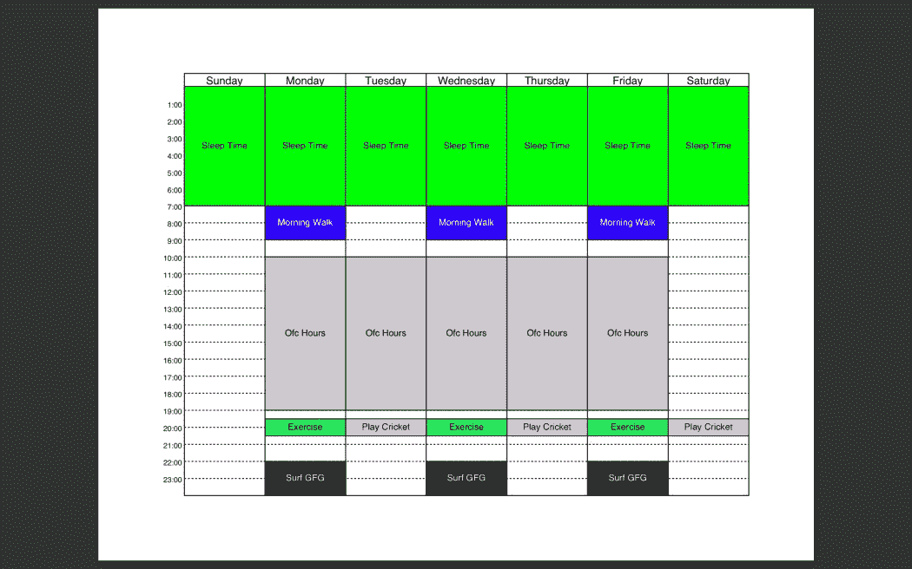

# Python 中使用 pdfschedule 的可视化时间表

> 原文:[https://www . geeksforgeeks . org/visual-time table-using-pdf schedule-in-python/](https://www.geeksforgeeks.org/visual-timetable-using-pdfschedule-in-python/)

时间安排是生活中最重要的部分，有一个时间表有助于建立一个常规。脑海中的无聊时间表或例行公事通常没有帮助。有一个华而不实的和视觉上吸引人的时间表吸引并因此推动我们去寻找和跟随。本文提供了一种简单的方法来为一周中的每一天生成一个 pdf 格式的文档，并使用 Python 对其进行跟踪。

**pdfschedule:** 该模块能够为每周的活动日程创建 PDF 格式的时间表，并支持自定义样式和颜色，使用命令行操作。

### 装置

这个模块没有内置 Python。要安装它，请在终端中键入以下命令。

```py
python3 -m pip install pdfschedule
```

### 入门指南

安装完成后，在命令行上运行以下命令:

```py
pdfschedule [<OPTIONS>] [<infile> [<outfile>]]
```

**参数:**

*   **中缀:**标准输入文件(yaml 格式)。
*   **输出文件:**pdf 格式的输出文件，与输入文件同名。<中缀>。
*   **选项:**可以传递的造型参数。

**选项:**

> *   **-c,–color:** The color of the event box and the standard hexadecimal code to be used.
> *   **-f < font >,-font < font >:** Any built-in font or path. Ttf file. The default is Helvetica.
> *   **-f < font size >,–font-size < font size >:** event name font size. Set the day name to < size > * 1.2, and set the time name to < size >/1.2\. The default is 10.
> *   **-m,–start-Monday:** Typing this content will render the beginning of the week as Monday, otherwise it will be Sunday.
> *   **-p,–Portrait** : Set the output table to portrait mode, and default to landscape mode.
> *   **-S < Factor >,–-scale 【T4] Factor >** : The edge of the table is shortened by "/factor". Otherwise, the table occupies the whole page, revealing the margins.
> *   **-t,–No times** : Ignore unused time.
> *   **–No weekends:** Weekends, Sundays and Saturdays have been deleted from the table.

### 输入文件

**Yaml:** 需要的 Yaml 是字典列表，其中每个字典代表一个时间表中的每个槽，以及它的显示描述。

**在 Yaml 中输入参数[对于每个时间表]**

*   **名称:**框中事件的名称。可选。
*   **天:**天重复上述日程。每个工作日的首字母大写和前两/三个首字母有效。单字母工作日表示在周一、周二、周三、周五有效。
*   **时间:**排班时间，“HH:MM–HH:MM”24 小时制。分钟可选。
*   **颜色:**计划的背景颜色(十六进制提供)，默认为灰色。

**示例:**

**输入文件:[ gfg_tt.yml ]**

```py
- name: Morning Walk
 days: MWF
 time: 7-9
 color: "0000FF"

- name: Ofc Hours
 days: MTWThF
 time: 10-19

- name: Exercise
 days: M, W, F
 time: 19:30 - 20:30
 color: "29EE65"

- name: Play Cricket
 days: Tu, Th, Sat
 time: 19:30 - 20:30
 color: "FF94EF"

- name: Surf GFG
 days: F, W, M
 time: 22-23.59
 color: "000000"

- name: Sleep Time
 days: MTWThFSatSun
 time: 0-7
 color: "00FF00"
```

**之后，在命令行运行该命令:**

```py
pdfschedule gfg_tt
```

**输出:**

