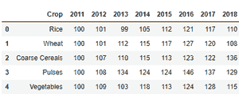
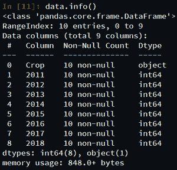
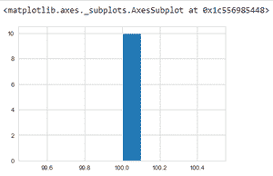
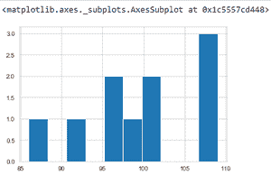
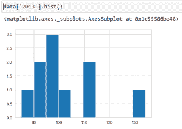
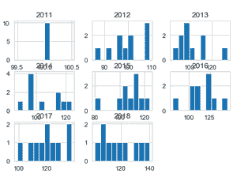
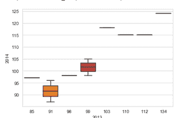
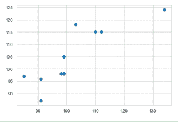
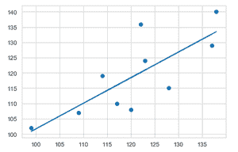
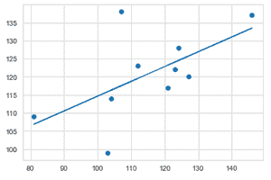

# 利用 Python 对作物生产数据进行可视化和预测

> 原文:[https://www . geeksforgeeks . org/使用 python 可视化和预测作物生产数据/](https://www.geeksforgeeks.org/visualization-and-prediction-of-crop-production-data-using-python/)

**前提:**[Python 中的数据可视化](https://www.geeksforgeeks.org/data-visualisation-in-python-using-matplotlib-and-seaborn/)

可视化就是看到各个维度的数据。在 python 中，我们可以使用不同模块中可用的各种图来可视化数据。

在本文中，我们将使用各种插图和 python 库来可视化和预测不同年份的作物生产数据。

### **数据集**

[数据集](https://drive.google.com/drive/u/0/folders/1k4z8rWn_jXzv4PoRUxqKNqu9Bv_Hq4B_)包含 2013–2020 年的不同作物及其产量。

### **要求**

有很多 python 库可以用来构建可视化，比如 *matplotlib、vispy、bokeh、seaborn、pygal、leaf、plotly、袖扣*和 *networkx* 。在众多的可视化工具中， *matplotlib* 和 *seaborn* 似乎被广泛用于基础到中级的可视化。

然而，上述两种被广泛用于可视化，即

*   **Matplotlib:** 这是 Python 中一个惊人的可视化库，用于数组的 2D 图，这是一个基于 *NumPy* 数组构建的多平台数据可视化库，旨在与更广泛的 *SciPy* 堆栈一起工作。使用以下命令安装此库:

```py
pip install matplotlib
```

*   **海伯恩:**这个图书馆位于*马特洛特利布*之上。从某种意义上说，它有一些 *matplotlib* 的味道，而从可视化的角度来看，它比 *matplotlib* 好得多，并且还增加了一些功能。使用以下命令安装此库:

```py
pip install seaborn
```

### 逐步方法

*   导入所需模块
*   加载数据集。
*   显示加载数据集的数据和约束。
*   使用不同的方法可视化数据中的各种插图。

### 形象化

以下是一些程序，它们指示数据并说明数据的各种可视化:

**例 1:**

## 蟒蛇 3

```py
# importing pandas module
import pandas as pd

# load the dataset
data = pd.read_csv('crop.csv')

# display top 5 values
data.head()
```

**输出:**



这些是所用数据集的前 5 行。

**例 2:**

## 蟒蛇 3

```py
# data description
data.info()
```

**输出:**



这些是数据集的数据约束。

**例 3:**

## 蟒蛇 3

```py
# 2011 crop data in histogram analysis
data['2011'].hist()
```

**输出:**



上述程序使用直方图描述了 2011 年的作物生产数据。

**例 4:**

## 蟒蛇 3

```py
# 2012 crop data in histogram analysis
data['2012'].hist()
```

**输出:**



上述程序使用直方图描述了 2012 年的作物生产数据。

**例 4:**

## 蟒蛇 3

```py
# 2013 crop data in histogram analysis
data['2013'].hist()
```

**输出:**



上述程序使用直方图描述了 2013 年的作物生产数据。

**例 5:**

## 蟒蛇 3

```py
# display all year data
data.hist()
```

**输出:**



上述程序使用多个直方图描述了所有可用时间段(年)的作物生产数据。

**例 6:**

## 蟒蛇 3

```py
# import seaborn module
import seaborn as sns

# setting style
sns.set_style("whitegrid")

# plotting data using boxplot for 2013 - 2014
sns.boxplot(x='2013', y='2014', data=data)
```

**输出:**



使用箱线图比较 2013 年和 2014 年的作物产量。

**例 7:**

## 蟒蛇 3

```py
# scatter plot 2013 data vs 2014 data
plt.scatter(data['2013'],data['2014'])

plt.show()
```

**输出:**



使用散点图比较 2013 年和 2014 年的作物产量。

**例 8:**

## 蟒蛇 3

```py
# line plot 2013 data vs 2014 data
plt.plot(data['2013'],data['2014'])

plt.show()
```

**输出:**


用线图比较 2013 年和 2014 年的作物产量。

**例 9:**

## 蟒蛇 3

```py
# import required modules
import matplotlib.pyplot as plt
from scipy import stats

# assign data
x = data['2017']
y = data['2018']

# linear regression 2017 data vs 2018 data
slope, intercept, r, p, std_err = stats.linregress(x, y)

# function to return slope
def myfunc(x):
    return slope * x + intercept

mymodel = list(map(myfunc, x))

# scatter
plt.scatter(x, y)

# plotting the data
plt.plot(x, mymodel)

# display the figure
plt.show()
```

**输出:**



应用线性回归可视化和比较 2017 年和 2018 年的预测作物产量数据。

**例 10:**

## 蟒蛇 3

```py
# import required modules
import matplotlib.pyplot as plt
from scipy import stats

# assign data
x = data['2016']
y = data['2017']

# linear regression 2017 data vs 2018 data
slope, intercept, r, p, std_err = stats.linregress(x, y)

# function to return slope
def myfunc(x):
    return slope * x + intercept

mymodel = list(map(myfunc, x))

# scatter
plt.scatter(x, y)

# plotting the data
plt.plot(x, mymodel)

# display the figure
plt.show()
```

**输出:**



应用线性回归来可视化和比较 2016 年和 2017 年之间的预测作物产量数据。

### 演示视频

本视频展示了如何使用 Jupyter Notebook 从头开始描绘上述数据可视化和预测数据。

<video class="wp-video-shortcode" id="video-507498-1" width="640" height="360" preload="metadata" controls=""><source type="video/mp4" src="https://media.geeksforgeeks.org/wp-content/uploads/20201029163931/Crop-Analysis.mp4?_=1">[https://media.geeksforgeeks.org/wp-content/uploads/20201029163931/Crop-Analysis.mp4](https://media.geeksforgeeks.org/wp-content/uploads/20201029163931/Crop-Analysis.mp4)</video>

通过这种方式，可以计算各种数据可视化和预测。