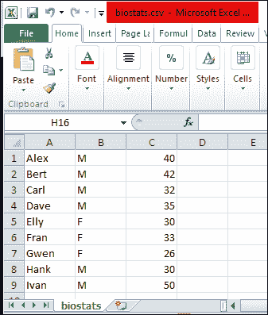
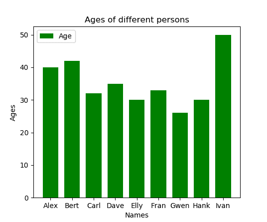
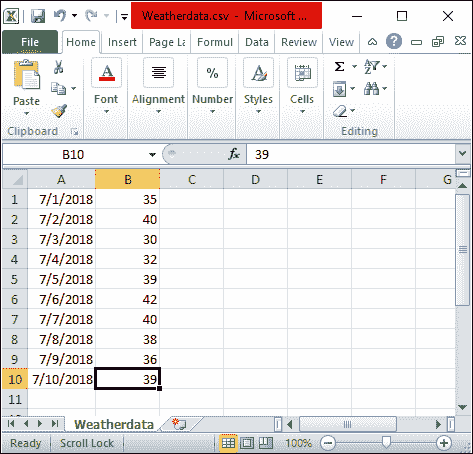
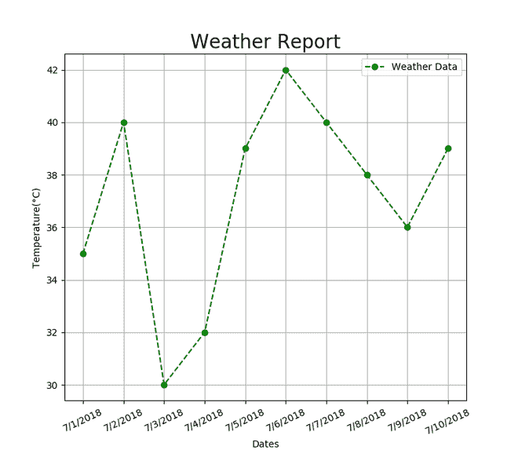
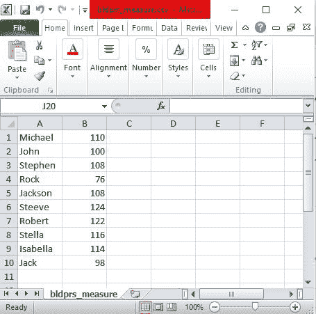
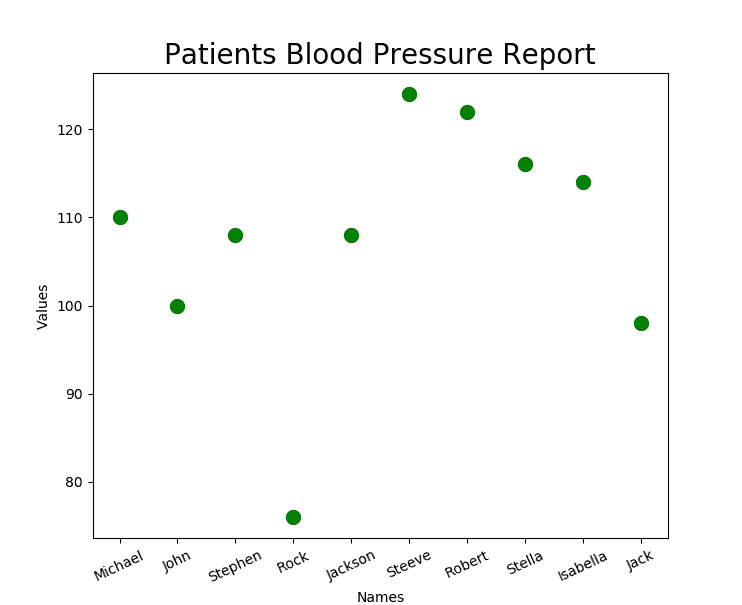
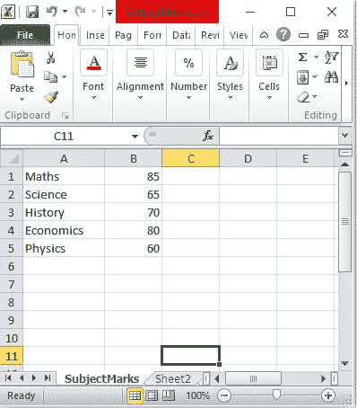
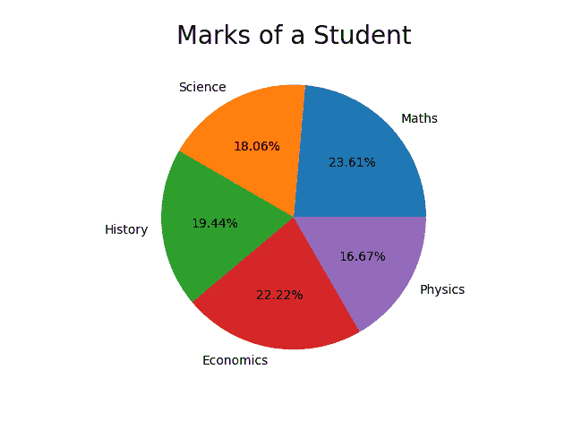

# 用 Python 可视化 CSV 文件中的数据

> 原文:[https://www . geesforgeks . org/visualize-data-from-CSV-file-in-python/](https://www.geeksforgeeks.org/visualize-data-from-csv-file-in-python/)

CSV 代表“**逗号分隔值**”。这意味着 CSV 文件中的数据(值)由分隔符分隔，即逗号。csv 文件中的数据以表格格式存储，扩展名为. CSV。通常，CSV 文件与谷歌电子表格或微软 Excel 工作表一起使用。CSV 文件包含许多记录，数据分布在行和列中。在本文中，我们将使用 Python 可视化 CSV 文件中的数据。

要提取 CSV 文件中的数据，必须在我们的程序中导入 CSV 模块，如下所示:

```
import csv

with open('file.csv') as File:  
    Line_reader = csv.reader(File) 
```

这里，csv.reader()函数用于导入 csv 库后读取程序。

**例 1:通过条形图可视化不同人物的** **列。**

下面的 CSV 文件包含保存为“biostats.csv”的不同姓名、性别和年龄:



**程序的进场:**

1.  导入所需库、用于可视化的 matplotlib 库和用于读取 CSV 数据的 CSV 库。
2.  使用 Open()函数从 CSV 库中以“r”模式(只读)打开文件，并使用 csv.reader()函数读取文件。
3.  使用 for 循环读取文件中的每一行。
4.  将所需列追加到列表中。
5.  读取整个 CSV 文件后，将所需数据绘制为 X 轴和 Y 轴。
6.  在本例中，我们将姓名标为 X 轴，年龄标为 Y 轴。

**下面是实现:**

## 蟒蛇 3

```
import matplotlib.pyplot as plt
import csv

x = []
y = []

with open('biostats.csv','r') as csvfile:
    plots = csv.reader(csvfile, delimiter = ',')

    for row in plots:
        x.append(row[0])
        y.append(int(row[2]))

plt.bar(x, y, color = 'g', width = 0.72, label = "Age")
plt.xlabel('Names')
plt.ylabel('Ages')
plt.title('Ages of different persons')
plt.legend()
plt.show()
```

**输出:**



**示例 2:可视化不同日期的天气报告”**直通线**图。**

不同日期的温度(摄氏度)存储在一个名为“天气数据. csv”的 CSV 文件中。这两行“日期”和“温度(摄氏度)”用作可视化天气报告的 X 轴和 Y 轴。



**程序进场:**

1.  导入所需的库、用于可视化的 matplotlib 库和用于读取 csv 数据的 CSV 库。
2.  使用 Open()函数从 CSV 库中以“r”模式(只读)打开文件，并使用 csv.reader()函数读取文件。
3.  使用 for 循环读取文件中的每一行。
4.  将 CSV 文件的必需列追加到列表中。
5.  读取整个 CSV 文件后，将所需数据绘制为 X 轴和 Y 轴。
6.  在本例中，我们将日期标为 X 轴，温度标为 Y 轴。

**下面是实现:**

## 蟒蛇 3

```
import matplotlib.pyplot as plt
import csv

x = []
y = []

with open('Weatherdata.csv','r') as csvfile:
    lines = csv.reader(csvfile, delimiter=',')
    for row in lines:
        x.append(row[0])
        y.append(int(row[1]))

plt.plot(x, y, color = 'g', linestyle = 'dashed',
         marker = 'o',label = "Weather Data")

plt.xticks(rotation = 25)
plt.xlabel('Dates')
plt.ylabel('Temperature(°C)')
plt.title('Weather Report', fontsize = 20)
plt.grid()
plt.legend()
plt.show()
```

**输出:**



**例 3:通过散点图**可视化医院患者血压报告



**通过散点图**实现“可视化患者血压报告”程序的方法:

1.  导入所需库，matplotlib 库用于可视化，导入 csv 库用于读取 CSV 数据。
2.  使用 Open()函数从 CSV 库中以“r”模式(只读)打开文件，并使用 csv.reader()函数读取文件。
3.  使用 for 循环读取文件中的每一行。
4.  将 CSV 文件的必需列追加到列表中。
5.  读取整个 CSV 文件后，将所需数据绘制为 X 轴和 Y 轴。
6.  在本例中，我们将患者姓名绘制为 X 轴，血压值绘制为 Y 轴。

**下面是实现:**

## 蟒蛇 3

```
import matplotlib.pyplot as plt
import csv

Names = []
Values = []

with open('bldprs_measure.csv','r') as csvfile:
    lines = csv.reader(csvfile, delimiter=',')
    for row in lines:
        Names.append(row[0])
        Values.append(int(row[1]))

plt.scatter(Names, Values, color = 'g',s = 100)
plt.xticks(rotation = 25)
plt.xlabel('Names')
plt.ylabel('Values')
plt.title('Patients Blood Pressure Report', fontsize = 20)

plt.show()
```

**输出:**



**示例 4:使用** **饼图**可视化不同科目的学生成绩



**程序进场:**

1.  导入所需库，matplotlib 库用于可视化，导入 csv 库用于读取 CSV 数据。
2.  使用 Open()函数从 CSV 库中以“r”模式(只读)打开文件，并使用 csv.reader()函数读取文件。
3.  使用 for 循环读取文件中的每一行。
4.  将 CSV 文件的必需列追加到列表中。
5.  读取整个 CSV 数据后，使用 plt.pie()函数将所需数据绘制为饼图。

**下面是实现:**

## 蟒蛇 3

```
import matplotlib.pyplot as plt
import csv

Subjects = []
Scores = []

with open('SubjectMarks.csv', 'r') as csvfile:
    lines = csv.reader(csvfile, delimiter = ',')
    for row in lines:
        Subjects.append(row[0])
        Scores.append(int(row[1]))

plt.pie(Scores,labels = Subjects,autopct = '%.2f%%')
plt.title('Marks of a Student', fontsize = 20)
plt.show()
```

**输出:**

