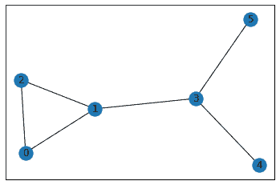

# 用 Python 可视化图形

> 原文:[https://www.geeksforgeeks.org/visualize-graphs-in-python/](https://www.geeksforgeeks.org/visualize-graphs-in-python/)

**先决条件:** [图形数据结构和算法](https://www.geeksforgeeks.org/graph-data-structure-and-algorithms/)

A [图](https://www.geeksforgeeks.org/graph-data-structure-and-algorithms/)是由节点和边组成的非线性数据结构。节点有时也称为顶点，边是连接图中任意两个节点的直线或圆弧。

在本教程中，我们将借助**网络**库在 Python 中可视化无向图。

**安装:**

要安装此模块，请在终端中键入以下命令。

```
pip install networkx
```

下面是实现。

```
# First networkx library is imported 
# along with matplotlib
import networkx as nx
import matplotlib.pyplot as plt

# Defining a Class
class GraphVisualization:

    def __init__(self):

        # visual is a list which stores all 
        # the set of edges that constitutes a
        # graph
        self.visual = []

    # addEdge function inputs the vertices of an
    # edge and appends it to the visual list
    def addEdge(self, a, b):
        temp = [a, b]
        self.visual.append(temp)

    # In visualize function G is an object of
    # class Graph given by networkx G.add_edges_from(visual)
    # creates a graph with a given list
    # nx.draw_networkx(G) - plots the graph
    # plt.show() - displays the graph
    def visualize(self):
        G = nx.Graph()
        G.add_edges_from(self.visual)
        nx.draw_networkx(G)
        plt.show()

# Driver code
G = GraphVisualization()
G.addEdge(0, 2)
G.addEdge(1, 2)
G.addEdge(1, 3)
G.addEdge(5, 3)
G.addEdge(3, 4)
G.addEdge(1, 0)
G.visualize()
```

**输出:**

