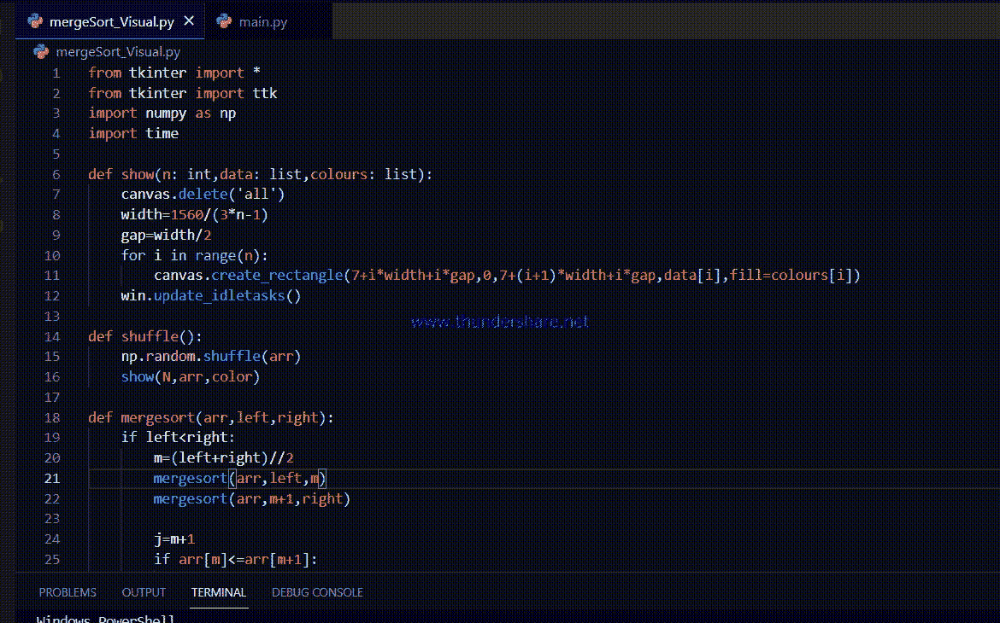

# 使用 Python 中的 Tkinter 可视化合并排序

> 原文:[https://www . geesforgeks . org/visualize-merge-sort-using-tkinter-in-python/](https://www.geeksforgeeks.org/visualize-merge-sort-using-tkinter-in-python/)

**先决条件:**[Python GUI–tkinter](https://www.geeksforgeeks.org/python-gui-tkinter/)

在本文中，我们将创建一个图形用户界面应用程序，它将帮助我们可视化 Python 中使用 Tkinter 的合并排序算法。

合并排序是一种流行的排序算法。它的时间复杂度为 N(logN)，比其他排序算法(如冒泡排序或选择排序)更快。通过创建这个应用程序，我们将能够直观地看到合并排序是如何工作的。合并排序遵循分治的范式。它包括三个步骤

*   **划分:**将问题划分为相似小问题的子集
*   **征服:**递归求解子问题。
*   **合并:**将子问题的解合并为一个，找到原答案

在合并排序中，数组被分成几乎相等的两半，这个过程一直持续到只有两个数组元素需要排序。然后我们合并它们，这样得到的数组将是一个排序的数组。它帮助我们理解或想象 mergesort 如何使用分治法。

## 入门指南

首先，导入项目所需的模块。导入 NumPy 以生成数组，并对其进行洗牌。导入 Tkinter 显然是为了创建 GUI 界面。最后，输入时间来减缓排序过程，这对可视化至关重要。

### 方法

*   定义了一个函数 show()，将数组显示为条。它需要三个参数 n、数据和颜色。n 是数组“data”的长度。Colors 是要在画布上绘制的每个条形的颜色数组。
*   Shuffle()是一个不言自明的函数，它只是对数组进行洗牌，并在调用函数时显示它。
*   然后是真正的 mergesort()实现函数。
*   Start()函数将触发 mergesort 函数，然后排序算法将开始。
*   win，创建一个 Tkit 对象。
*   然后创建一个画布和两个按钮，分配相应的功能，这些功能将在按下按钮时触发。

### 颜色代码:

合并时，所选的两个元素用蓝色显示。如果第一个子阵列的元素大于最后一个子阵列的元素，则使用红色。一旦两个元素互换，它就会显示绿色。当数组最终被排序时，所有条的最终颜色将是紫色。

**代码:**

## 蟒蛇 3

```
# importing all necessary modules
from tkinter import *
from tkinter import ttk
import numpy as np
import time

def show(n: int, data: list, colours: list):

    # n is length of the array data
    # data is the array itself
    # colours is an array of colors
    canvas.delete('all')

    # width variable is the width of each bar
    width = 1560/(3*n-1)

    # gap is the spacing between the bars
    gap = width/2

    for i in range(n):

        # this function will display an array of "bar"
        canvas.create_rectangle(7+i*width+i*gap, 0, 7 +
                                (i+1)*width+i*gap, data[i],
                                fill=colours[i])

    # this function will help us to see every step
    # of the sorting algorithm
    # the purpose of this function is to update the screen
    # in runtime
    win.update_idletasks()

def shuffle():
    np.random.shuffle(arr)
    show(N, arr, color)

def mergesort(arr, left, right):
    if left < right:
        m = (left+right)//2
        mergesort(arr, left, m)
        mergesort(arr, m+1, right)

        j = m+1
        if arr[m] <= arr[m+1]:
            return

        while left <= m and j <= right:
            show(N, arr, ['blue' if x == left or x ==
                          j else 'grey' for x in range(N)])
            time.sleep(1/speed)
            if arr[left] <= arr[j]:
                left += 1
            else:
                show(N, arr, ['red' if x == left or x ==
                              j else 'grey' for x in range(N)])

                # array of colours where only the focused bars
                # are displayed red since left >arr[j]
                time.sleep(1/speed)
                temp = arr[j]

                # storing the smaller element in temp variable
                i = j
                while i != left:
                    arr[i] = arr[i-1]
                    show(N, arr, ['red' if x == i or x ==
                                  j else 'grey' for x in range(N)])
                    time.sleep(1/speed)
                    i -= 1

                # this while loop will shift all the elements one step
                # to right to make the place empty for the temp variable
                # upon reaching the desired location i.e. left, the
                # temp value will be inserted into that location.
                # this process is much like insertion sort
                arr[left] = temp

                show(N, arr, ['green' if x == left or x ==
                              j else 'grey' for x in range(N)])
                time.sleep(1/speed)
                left += 1
                m += 1
                j += 1

# this function call the mergesort function which will
# start the animation.
def start():
    mergesort(arr, 0, N-1)
    show(N, arr, ['purple' for _ in range(N)])

win = Tk()

N = 50  # length of the array
speed = 100  # how fast the array will be sorted

# creating the array using linspace function
# from numpy
arr = np.linspace(10, 390, N, dtype=np.uint16)

color = ['grey' for _ in range(N)]

ttk.Label(win, text='Merge Sort visualizer').pack()
canvas = Canvas(win, width=800, height=400, bg='white')
canvas.pack()

ttk.Button(win, text='Start sorting', command=start).pack(
    side='right', padx=5, pady=5)

ttk.Button(win, text='Shuffle array', command=shuffle).pack(side='right')
shuffle()
show(N, arr, color)

win.mainloop()
```

**输出**:

