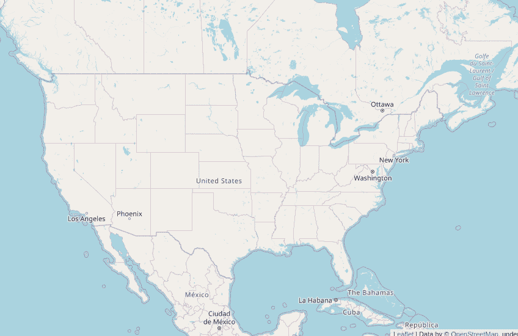
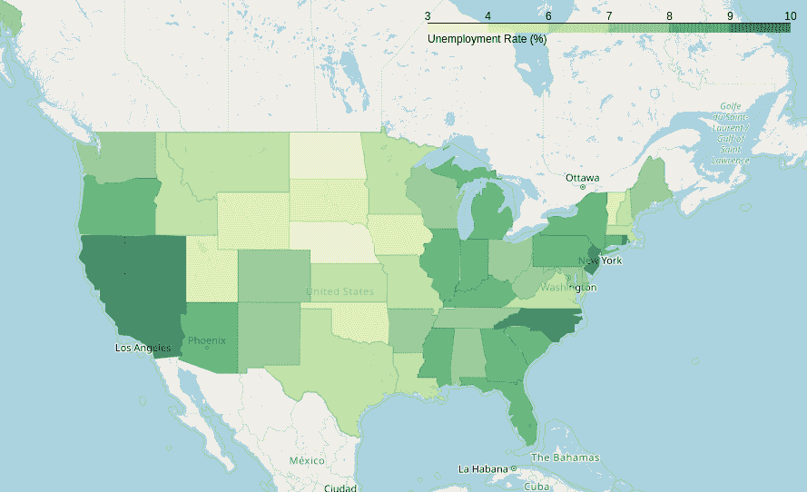

# 使用 Python 中的树叶可视化地理空间数据

> 原文:[https://www . geeksforgeeks . org/visualizing-geography-data-use-leaf-in-python/](https://www.geeksforgeeks.org/visualizing-geospatial-data-using-folium-in-python/)

对于处理国家、城市等数据集的人来说，最重要的任务之一。理解他们数据的物理位置和地理环境之间的关系。可视化数据的一种方法是使用**树叶**。

leaf 是 Python 中一个强大的数据可视化库，主要是为了帮助人们可视化地理空间数据而构建的。有了树叶，人们可以创建世界上任何地方的地图。leaf 实际上是 fob . js 的 python 包装器，fob . js 是一个用于绘制交互式地图的 javascript 库。

我们现在将看到一种绘制和可视化地理空间数据的简单方法。我们将使用由美国失业率组成的数据集

### 装置

如果未安装 leaf，只需使用以下任一命令即可安装:

```
$ pip install folium

OR

$ conda install -c conda-forge folium
```

使用[叶。Map()](https://www.geeksforgeeks.org/python-plotting-google-map-using-folium-package/) ，我们将创建一个基础地图，并将其存储在一个对象中。该函数以位置坐标和缩放值为参数。

> ***语法:*** 树叶。地图(*位置，平铺*
> 
> ***参数:***
> 
> *   ***位置** :* 位置坐标列表
> *   ***瓦片** :* 默认为 OpenStreetMap。其他选项:塔门地形，雄蕊爽肤水，地图框明亮等。
> *   ***【zoom _ start】**:*int

**代码:**

## 蟒蛇 3

```
# import the folium, pandas libraries
import folium
import pandas as pd

# initialize the map and store it in a m object
m = folium.Map(location = [40, -95],
               zoom_start = 4)

# show the map
m.save('my_map.html')
```

**输出:**



### **使用熊猫导入数据集:**

现在，我们将使用[熊猫](https://www.geeksforgeeks.org/python-pandas-dataframe/)库导入数据集。

## 蟒蛇 3

```
# getting the data
url = (
    "https://raw.githubusercontent.com/python-visualization/folium/master/examples/data"
)
state_geo = f"{url}/us-states.json"
state_unemployment = f"{url}/US_Unemployment_Oct2012.csv"
state_data = pd.read_csv(state_unemployment)
```

### 使用数据集创建地图:

一旦我们有了所有的数据，我们将使用 choropleth 地图可视化这些数据。基于呈现给它们的统计变量，氯体积图以各种颜色表示划分的区域。在这里，我们用美国的失业率作为一种手段，将地区划分为不同的颜色。

使用**叶。choropeth()**，我们可以绘制最终地图。每个属性的细节都在代码中给出。“**键上的“**参数是指 JSON 对象(state_geo)中的标签，该标签将州详细信息作为附加到每个国家的边境信息的特征标识。数据框中的状态应该与 json 对象中的特征标识相匹配。

> **句法:**叶。颜色(地理数据、名称、数据、列、填充颜色、填充不透明度、线条不透明度、键开、图例名称)
> 
> **参数:**
> 
> *   geo_data:一组地理区域及其边界坐标
> *   名称:字符串(我们地图的名称)
> *   数据:每个区域的数值，用于颜色
> *   列:列表(我们需要处理的列)
> *   填充颜色:地图的颜色，例如:YlGn
> *   填充 _ 不透明度:填充颜色的不透明度
> *   线条不透明度:边框线条的不透明度
> *   图例名称:字符串

最后，我们可以将地图保存为一个 HTML 文件。

## 蟒蛇 3

```
folium.Choropleth(

      # geographical locations
    geo_data = state_geo,                     
    name = "choropleth",

      # the data set we are using
    data = state_data,                        
    columns = ["State", "Unemployment"],     

      # YlGn refers to yellow and green
    fill_color = "YlGn",                      
    fill_opacity = 0.7,
    line_opacity = .1,
      key_on = "feature.id",
    legend_name = "Unemployment Rate (%)",
).add_to(m)                                 

m.save('final_map.html')
```

**输出:**

