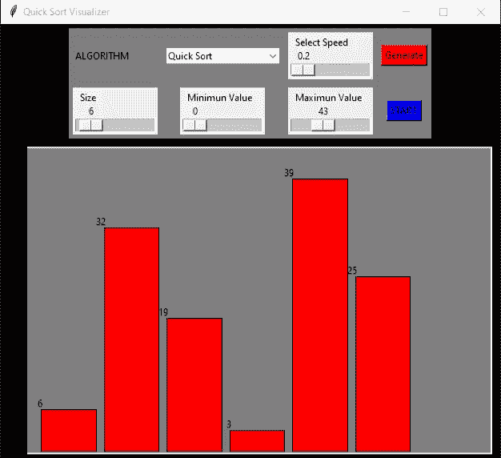

# 在 Python 中使用 Tkinter 可视化快速排序

> 原文:[https://www . geesforgeks . org/visiting-quick-sort-using-tkinter-in-python/](https://www.geeksforgeeks.org/visualizing-quick-sort-using-tkinter-in-python/)

**先决条件:** [快速排序](https://www.geeksforgeeks.org/quick-sort/)

**Tkinter** 是一个非常易用且对初学者友好的 GUI 库，可以用来可视化排序算法。这里的快速排序算法是可视化的，这是一个分治算法。它首先考虑一个透视元素，然后创建两个子数组来保存小于透视值的元素和大于透视值的元素，然后递归地对子数组进行排序。算法中有两个基本操作，就地交换项目和对数组的一部分进行分区。通过递归重复该过程，直到子阵列足够小以便于排序。最终，较小的子阵列可以一个放在另一个上面，以产生完全排序和有序的元素集。

在本文中，我们将使用 Python GUI 库 [Tkinter](https://www.geeksforgeeks.org/python-gui-tkinter/) 来可视化快速排序算法。

**算法:**

1.  选择任意元素作为轴心
2.  小于枢轴的元素放在它的前面，大于枢轴的元素放在它的后面。在枢轴的两侧创建两个子阵列。
3.  对左右子阵列递归应用相同的过程来对它们进行排序。

**时间复杂度:**

*   **最佳情况:**最佳情况发生在枢轴总是将数组分成相等的两半时。在最好的情况下，结果将是分区的对数(N)级，顶层有一个大小为 N 的数组，下一个有一个大小为 N/2 的数组，依此类推。快速排序算法的最佳复杂度是**0(对数 N)**
*   **最差情况:**最差情况将发生在数据透视表破坏数组的工作做得不好时，即一个分区中没有元素，而另一个分区中有 N-1 个元素时。快速排序的最坏时间复杂度是 **O(N^2)** 。

**快速排序扩展码:**

这是快速排序算法的扩展代码，它被导入到主 Tkinter 可视化工具代码中，以实现快速排序算法并返回排序结果。

## 蟒蛇 3

```
# Extension Quick Sort Code
# importing time module
import time

# to implement divide and conquer
def partition(data, head, tail, drawData, timeTick):
    border = head
    pivot = data[tail]

    drawData(data, getColorArray(len(data), head,
                                 tail, border, border))
    time.sleep(timeTick)

    for j in range(head, tail):
        if data[j] < pivot:
            drawData(data, getColorArray(
                len(data), head, tail, border, j, True))
            time.sleep(timeTick)

            data[border], data[j] = data[j], data[border]
            border += 1

        drawData(data, getColorArray(len(data), head,
                                     tail, border, j))
        time.sleep(timeTick)

    # swapping pivot with border value
    drawData(data, getColorArray(len(data), head,
                                 tail, border, tail, True))
    time.sleep(timeTick)

    data[border], data[tail] = data[tail], data[border]

    return border

# head  --> Starting index,
# tail  --> Ending index
def quick_sort(data, head, tail,
               drawData, timeTick):
    if head < tail:
        partitionIdx = partition(data, head,
                                 tail, drawData,
                                 timeTick)

        # left partition
        quick_sort(data, head, partitionIdx-1,
                   drawData, timeTick)

        # right partition
        quick_sort(data, partitionIdx+1,
                   tail, drawData, timeTick)

# Function to apply colors to bars while sorting:
# Grey - Unsorted elements
# Blue - Pivot point element
# White - Sorted half/partition
# Red - Starting pointer
# Yellow - Ending pointer
# Green - after all elements are sorted

# assign color representation to elements

def getColorArray(dataLen, head, tail, border,
                  currIdx, isSwaping=False):
    colorArray = []
    for i in range(dataLen):
        # base coloring
        if i >= head and i <= tail:
            colorArray.append('Grey')
        else:
            colorArray.append('White')

        if i == tail:
            colorArray[i] = 'Blue'
        elif i == border:
            colorArray[i] = 'Red'
        elif i == currIdx:
            colorArray[i] = 'Yellow'

        if isSwaping:
            if i == border or i == currIdx:
                colorArray[i] = 'Green'

    return colorArray
```

**Tkinter 实现:**

在这段代码中，我们将数据值生成为不同长度和特定颜色的条。基本布局设计在一个 Tkinter 'Frame '中，当条生成和快速排序算法可视化时的部分设计在一个 Tkinter 'Canvas '中。

该代码主要包含以下组件:

*   **大型机:**一个 Tkinter 框架，用于排列所有必要的组件(标签、按钮、速度栏等)。)以有组织的方式
*   **画布:**用作绘制生成的数据条并可视化排序过程的空间的 Tkinter 画布
*   **generate():** 通过接受一个范围，然后将其作为参数传递给 drawData()函数来生成数据值的方法
*   **drawData():** 生成画布上特定颜色的归一化数据值(在给定范围内)的条形图的方法
*   **start_algorithm():** 按下“start”按钮时，调用该功能。它通过从快速排序扩展代码中调用 quick_sort()函数来启动排序过程。

## 蟒蛇 3

```
# code for Quick Sort Visualizer
# using Python and Tkinter
# import modules
from tkinter import *
from tkinter import ttk
import random
from quick import quick_sort

# initialising root class for Tkinter
root = Tk()
root.title("Quick Sort Visualizer")

# maximum window size
root.maxsize(900, 600)
root.config(bg="Black")

select_alg = StringVar()
data = []

# function to generate the data values
# by accepting a given range
def generate():

    global data

    # minval : minimum value of the range
    minval = int(minEntry.get())

    # maxval : maximum value of the range
    maxval = int(maxEntry.get())

    # sizeval : number of data
    # values/bars to be generated
    sizeval = int(sizeEntry.get())

    # creating a blank data list which will
    # be further filled with random data values
    # within the entered range
    data = []
    for _ in range(sizeval):
        data.append(random.randrange(minval, maxval+1))

    drawData(data, ['Red' for x in range(len(data))])

# function to create the data bars
# by creating a canvas in Tkinter
def drawData(data, colorlist):
    canvas.delete("all")
    can_height = 380
    can_width = 550
    x_width = can_width/(len(data) + 1)
    offset = 30
    spacing = 10
    # normalizing data for rescaling real-valued
    # numeric data within the
    # given range
    normalized_data = [i / max(data) for i in data]

    for i, height in enumerate(normalized_data):
        # top left corner
        x0 = i*x_width + offset + spacing
        y0 = can_height - height*340

        # bottom right corner
        x1 = ((i+1)*x_width) + offset
        y1 = can_height

        # data bars are generated as Red
        # colored vertical rectangles
        canvas.create_rectangle(x0, y0, x1, y1,
                                fill=colorlist[i])
        canvas.create_text(x0+2, y0, anchor=SE,
                           text=str(data[i]))
    root.update_idletasks()

# function to initiate the sorting
# process by calling the extension code
def start_algorithm():
    global data

    if not data:
        return

    if (algmenu.get() == 'Quick Sort'):
        quick_sort(data, 0, len(data)-1, drawData, speedbar.get())
        drawData(data, ['Green' for x in range(len(data))])

# creating main user interface frame
# and basic layout by creating a frame
Mainframe = Frame(root, width=600, height=200, bg="Grey")
Mainframe.grid(row=0, column=0, padx=10, pady=5)

canvas = Canvas(root, width=600, height=380, bg="Grey")
canvas.grid(row=1, column=0, padx=10, pady=5)

# creating user interface area in grid manner
# first row components
Label(Mainframe, text="ALGORITHM",
      bg='Grey').grid(row=0, column=0,
                      padx=5, pady=5,
                      sticky=W)

# algorithm menu for showing the
# name of the sorting algorithm
algmenu = ttk.Combobox(Mainframe,
                       textvariable=select_alg,
                       values=["Quick Sort"])
algmenu.grid(row=0, column=1, padx=5, pady=5)
algmenu.current(0)

# creating Start Button to start
# the sorting visualization process
Button(Mainframe, text="START",
       bg="Blue",
       command=start_algorithm).grid(row=1,
                                     column=3,
                                     padx=5,
                                     pady=5)

# creating Speed Bar using scale in Tkinter
speedbar = Scale(Mainframe, from_=0.10,
                 to=2.0, length=100, digits=2,
                 resolution=0.2, orient=HORIZONTAL,
                 label="Select Speed")
speedbar.grid(row=0, column=2,
              padx=5, pady=5)

# second row components
# sizeEntry : scale to select
# the size/number of data bars
sizeEntry = Scale(Mainframe, from_=3,
                  to=60, resolution=1,
                  orient=HORIZONTAL,
                  label="Size")
sizeEntry.grid(row=1, column=0,
               padx=5, pady=5)

# minEntry : scale to select the
# minimum value of data bars
minEntry = Scale(Mainframe, from_=0,
                 to=10, resolution=1,
                 orient=HORIZONTAL,
                 label="Minimum Value")
minEntry.grid(row=1, column=1,
              padx=5, pady=5)

# maxEntry : scale to select the
# maximum value of data bars
maxEntry = Scale(Mainframe, from_=10,
                 to=100, resolution=1,
                 orient=HORIZONTAL,
                 label="Maximum Value")
maxEntry.grid(row=1, column=2,
              padx=5, pady=5)

# creating generate button
Button(Mainframe, text="Generate",
       bg="Red",
       command=generate).grid(row=0,
                              column=3,
                              padx=5,
                              pady=5)

# to stop automatic window termination
root.mainloop()
```

**输出:**

