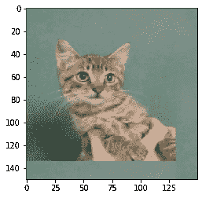
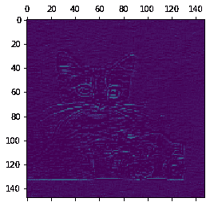
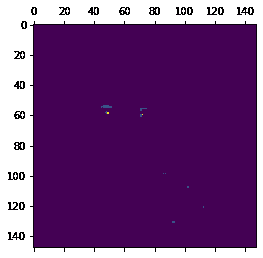
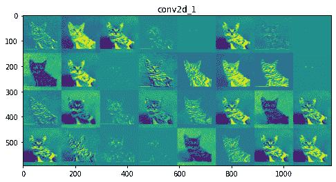
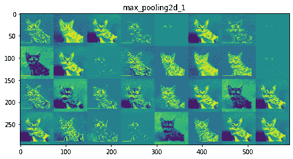
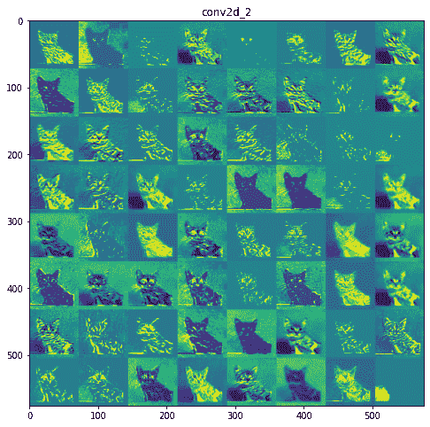
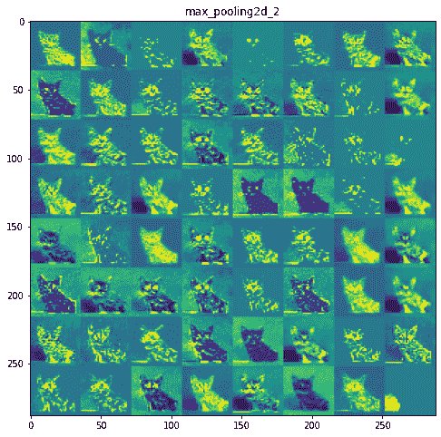
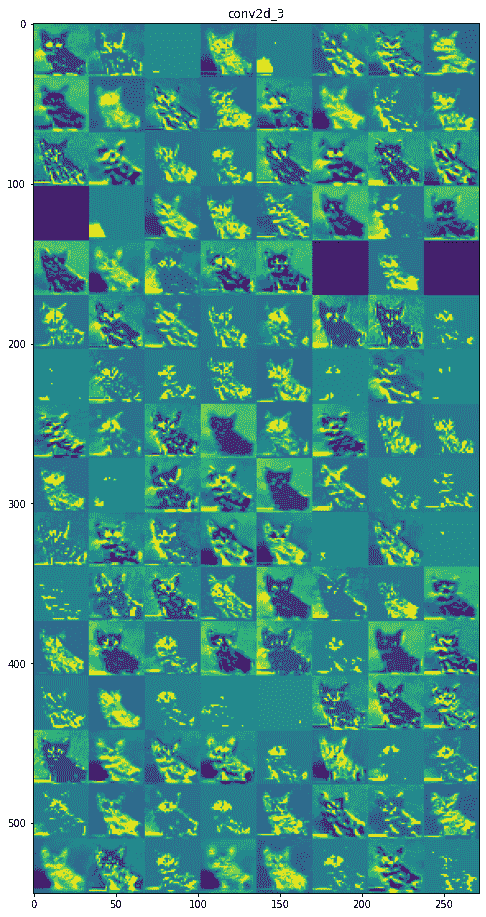
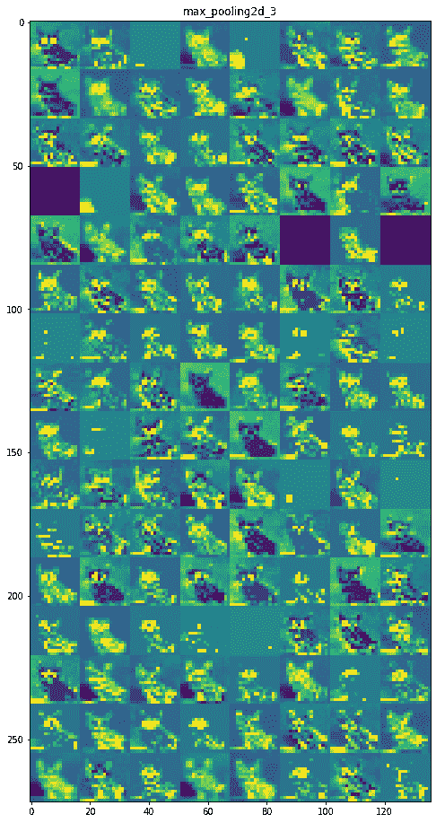
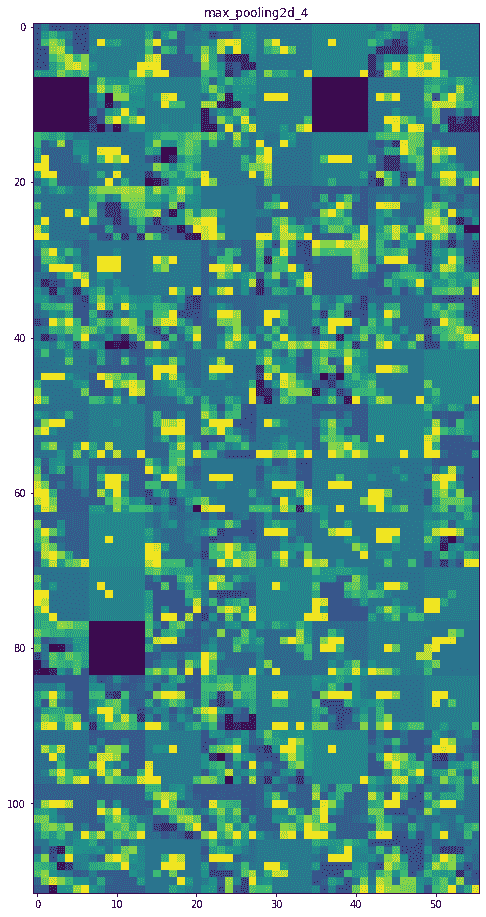

# 可视化表示每个 CNN 层的输出/激活

> 原文:[https://www . geeksforgeeks . org/visualizing-表示-输出-激活-每层-CNN/](https://www.geeksforgeeks.org/visualizing-representations-of-outputs-activations-of-each-cnn-layer/)

卷积神经网络在图像分类和识别任务中非常强大。CNN 模型学习训练图像的特征，在每一层应用不同的过滤器。在每个卷积层学习到的特征差异很大。观察到的事实是，初始层主要捕获边缘、图像的方向和图像中的颜色，这些是低级特征。随着层数的增加，美国有线电视新闻网捕捉高级特征，帮助区分不同类别的图像。
为了理解卷积神经网络是如何学习图像的空间和时间相关性的，在每一层捕获的不同特征可以用以下方式可视化。

```py
To visualize the features at each layer, Keras Model class is used. 
It allows the model to have multiple outputs.
It maps given a list of input tensors to list of output tensors. 

**tf.keras.Model()**

Arguments:
inputs: It can be a single input or a list of inputs which are objects of keras.Input class
outputs: Output/ List of outputs.

```

考虑到一个包含猫和狗图像的数据集，我们构建了一个卷积神经网络，并在其上添加了一个分类器，以识别给定的图像是猫还是狗。

**Step 1: Loading the dataset and preprocessing the data**

使用`Keras ImageDataGenerator`将训练图像和验证图像加载到数据生成器中。
类模式被认为是“二进制”，批处理大小被认为是 20。图像的目标大小固定为(150，150)。

```py
from keras.preprocessing.image import ImageDataGenerator
train_datagen = ImageDataGenerator(rescale = 1./255)
test_datagen = ImageDataGenerator(rescale = 1./255)

train_generator = train_datagen.flow_from_directory(train_img_path, target_size =(150, 150), 
                                                      batch_size = 20, class_mode = "binary")

validation_generator = test_datagen.flow_from_directory(val_img_path, target_size =(150, 150),
                                                      batch_size = 20, class_mode = "binary")
```

**第二步:模型的架构**
增加了二维卷积层和最大池层的组合，在此基础上还增加了一个密集的分类层。对于最终的密集层，使用 Sigmoid 激活函数，因为它是一个两类分类问题。

```py
from keras import models
from keras import layers

model = models.Sequential()

model.add(layers.Conv2D(32, (3, 3), activation ='relu', input_shape =(150, 150, 3)))
model.add(layers.MaxPooling2D((2, 2)))

model.add(layers.Conv2D(64, (3, 3), activation ='relu'))
model.add(layers.MaxPooling2D((2, 2)))

model.add(layers.Conv2D(128, (3, 3), activation ='relu'))
model.add(layers.MaxPooling2D((2, 2)))

model.add(layers.Conv2D(128, (3, 3), activation ='relu'))
model.add(layers.MaxPooling2D((2, 2)))

model.add(layers.Flatten())

model.add(layers.Dense(512, activation ='relu'))
model.add(layers.Dense(1, activation ="sigmoid"))

model.summary()
```

**输出:车型总结**

```py
Model: "sequential_1"
_________________________________________________________________
Layer (type)                 Output Shape              Param #   
=================================================================
conv2d_1 (Conv2D)            (None, 148, 148, 32)      896       
_________________________________________________________________
max_pooling2d_1 (MaxPooling2 (None, 74, 74, 32)        0         
_________________________________________________________________
conv2d_2 (Conv2D)            (None, 72, 72, 64)        18496     
_________________________________________________________________
max_pooling2d_2 (MaxPooling2 (None, 36, 36, 64)        0         
_________________________________________________________________
conv2d_3 (Conv2D)            (None, 34, 34, 128)       73856     
_________________________________________________________________
max_pooling2d_3 (MaxPooling2 (None, 17, 17, 128)       0         
_________________________________________________________________
conv2d_4 (Conv2D)            (None, 15, 15, 128)       147584    
_________________________________________________________________
max_pooling2d_4 (MaxPooling2 (None, 7, 7, 128)         0         
_________________________________________________________________
flatten_1 (Flatten)          (None, 6272)              0         
_________________________________________________________________
dense_1 (Dense)              (None, 512)               3211776   
_________________________________________________________________
dense_2 (Dense)              (None, 1)                 513       
=================================================================
Total params: 3, 453, 121
Trainable params: 3, 453, 121
Non-trainable params: 0

```

**第三步:在猫狗数据集**
上编译训练模型损失函数:二元交叉熵
优化器:RMSprop
度量:准确性

```py
from keras import optimizers

model.compile(loss ="binary_crossentropy", optimizer = optimizers.RMSprop(lr = 1e-4),
metrics =['accuracy'])

history = model.fit_generator(train_generator, steps_per_epoch = 100, epochs = 30,
validation_data = validation_generator, validation_steps = 50)
```

**步骤 4:可视化中间激活(每层的输出)**

考虑不用于训练的图像，即来自测试数据的图像，将图像的路径存储在变量‘image _ path’中。

```py
from keras.preprocessing import image
import numpy as np

# Pre-processing the image
img = image.load_img(image_path, target_size = (150, 150))
img_tensor = image.img_to_array(img)
img_tensor = np.expand_dims(img_tensor, axis = 0)
img_tensor = img_tensor / 255.

# Print image tensor shape
print(img_tensor.shape)

# Print image
import matplotlib.pyplot as plt
plt.imshow(img_tensor[0])
plt.show()
```

**输出:**

```py
Tensor shape:
(1, 150, 150, 3)

Input image:


```

**代码:使用 Keras 模型类获取各层输出**

```py
# Outputs of the 8 layers, which include conv2D and max pooling layers
layer_outputs = [layer.output for layer in model.layers[:8]]
activation_model = models.Model(inputs = model.input, outputs = layer_outputs)
activations = activation_model.predict(img_tensor)

# Getting Activations of first layer
first_layer_activation = activations[0]

# shape of first layer activation
print(first_layer_activation.shape)

# 6th channel of the image after first layer of convolution is applied
plt.matshow(first_layer_activation[0, :, :, 6], cmap ='viridis')

# 15th channel of the image after first layer of convolution is applied
plt.matshow(first_layer_activation[0, :, :, 15], cmap ='viridis')
```

**输出:**

```py
First layer activation shape:
(1, 148, 148, 32)

Sixth channel of first layer activation:


Fifteenth channel of first layer activation: 


```

如前所述，初始层识别低级特征。第六个通道识别图像中的边缘，而第十五个通道识别眼睛的颜色。

**代码:我们模型中八层的名称**

```py
layer_names = []

for layer in model.layers[:8]:
  layer_names.append(layer.name)
print(layer_names)
```

**输出:**

```py
Layer names:

['conv2d_1',
 'max_pooling2d_1',
 'conv2d_2',
 'max_pooling2d_2',
 'conv2d_3',
 'max_pooling2d_3',
 'conv2d_4',
 'max_pooling2d_4']

```

**各层特征图:**
***第 1 层:conv2d _ 1***
[](https://media.geeksforgeeks.org/wp-content/uploads/20200614161148/conv2d_1.png)

***第 2 层:max _ pool2d _ 1***
[](https://media.geeksforgeeks.org/wp-content/uploads/20200614161211/max_pooling2d_1.png)

***第 3 层:conv2d _ 2***
[](https://media.geeksforgeeks.org/wp-content/uploads/20200614161234/conv2d_2.png)

***第 4 层:max _ pool 2d _ 2***
[](https://media.geeksforgeeks.org/wp-content/uploads/20200614161302/max_pooling2d_2.png)

***第 5 层:conv2d _ 3***
[](https://media.geeksforgeeks.org/wp-content/uploads/20200614161326/conv2d_3.png)

***第 6 层:max _ pool 2d _ 3***

[](https://media.geeksforgeeks.org/wp-content/uploads/20200614161355/max_pooling2d_3.png)

***第 7 层:conv2d _ 4***
[](https://media.geeksforgeeks.org/wp-content/uploads/20200614161424/conv2d_4.png)

***第 8 层:max _ pool 2d _ 4***
[](https://media.geeksforgeeks.org/wp-content/uploads/20200614161445/max_pooling2d_4.png)

**推断:**
初始图层更易解释，保留了输入图像中的大部分特征。随着图层级别的增加，特征变得不太可解释，变得更加抽象，并且识别特定于类别的特征，而留下图像的一般特征。

**参考文献:**

*   https://keras.io/api/models/model/
*   https://www.kaggle.com/c/dogs-vs-cats
*   https://www.geeksforgeeks.org/introduction-convolution-neural-network/