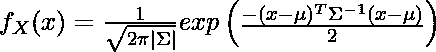
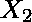
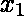
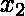
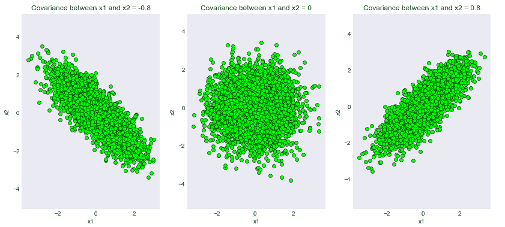
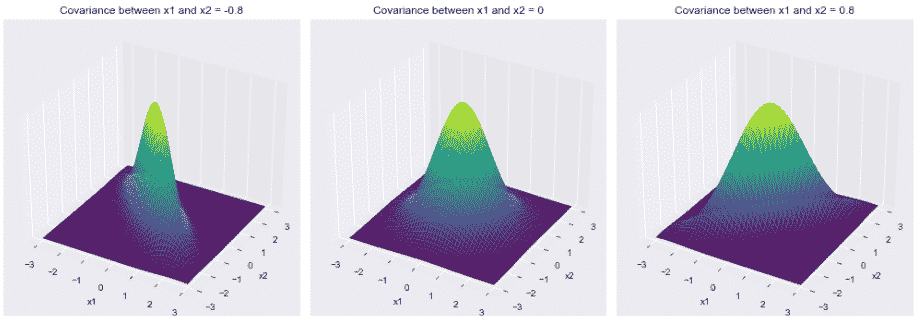
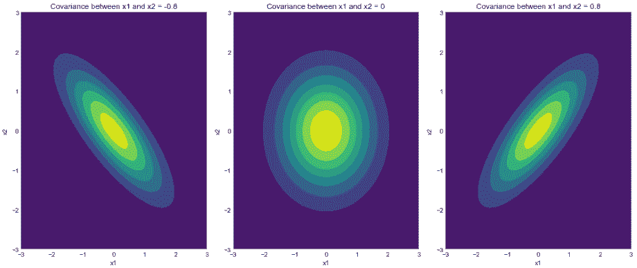

# 在 Python 中可视化二元高斯分布

> 原文:[https://www . geeksforgeeks . org/可视化-python 中的二元高斯分布/](https://www.geeksforgeeks.org/visualizing-the-bivariate-gaussian-distribution-in-python/)

高斯分布(或正态分布)是自然界中最基本的概率分布之一。从它在日常生活中的出现到它在统计学习技术中的应用，它是有史以来最深刻的数学发现之一。本文将朝着多维分布前进，对二元正态分布有一个直观的认识。

覆盖二元分布的好处是，我们可以使用适当的几何图形直观地看到和理解。此外，通过二元分布学到的相同概念可以扩展到任何维数。我们将首先简要介绍分布的理论方面，并对它的各个方面进行详尽的分析，比如 Python 中的协方差矩阵和密度函数！

### 二元高斯分布的概率密度函数

密度函数描述了给定样本下随机变量的相对似然性。如果给定样本附近的值较高，这意味着随机变量在随机采样时最有可能采用该值*。由于其特有的“钟形”，给定二元高斯随机变量的密度函数在数学上定义为:*

**

*其中是任何输入向量，而符号和具有它们通常的含义。*

*本文中使用的主要函数是 scipy 实用程序中的 Scipy . stats . multiply _ normal 函数，用于  a 多元正态随机变量。*

> ***语法:**scipy . stats . multiply _ normal(均值=无，cov=1)*
> 
> ***非可选参数:***
> 
> *   ***平均值:**一个数值数组指定分布的平均值*
> *   ***cov:** 指定正定协方差矩阵的 Numpy 数组*
> *   ***种子:**产生可重复结果的随机种子*
> 
> ***返回:**一个多变量正态随机变量对象 scipy . stats . _ multiply . multiply _ normal _ gen 对象。对本文有用的返回对象的一些方法如下:*
> 
> *   ***pdf(x):** 返回密度函数值“x”*
> *   ***rvs(大小):**从生成的多元高斯分布中提取“大小”数量的样本*

### *协方差矩阵的“可视化”视图*

*协方差矩阵可能是二元高斯分布中最有用的成分之一。协方差矩阵的每个元素定义了每个后续随机变量对之间的协方差。两个随机变量和之间的协方差在数学上被定义为![\sigma(X_1,X_2) = \mathop{\mathbb{E}}[(X_1-\mathop{\mathbb{E}}[X_1])(X_2-\mathop{\mathbb{E}}[X_2])]       ](img/46a4819576457fd87778d94aa5a7ecc1.png "Rendered by QuickLaTeX.com")，其中![\mathop{\mathbb{E}}[X]      ](img/66f90a2b037f9f347e126a5c5c612d36.png "Rendered by QuickLaTeX.com")表示给定随机变量的期望值。直观地说，通过观察协方差矩阵的对角元素，我们可以很容易地想象出 2D 两个高斯随机变量所画出的轮廓。以下是如何:*

*右对角线中的值表示相应随机变量的两个分量之间的联合协方差。如果值为+ve，这意味着两个随机变量之间存在正协方差，这意味着如果我们沿着增加的方向前进，那么也将沿着该方向增加，反之亦然。同样，如果该值为负，则意味着将向增加的方向减少。*

***下面是协方差矩阵的实现:***

*在下面的代码片段中，我们将生成 3 个不同的高斯二元分布，它们具有相同的均值![\mu = \begin{bmatrix}0\\[1ex]0\end{bmatrix}     ](img/7bbec599bb80324c4a212c5f55d4fda6.png "Rendered by QuickLaTeX.com")但具有不同的协方差矩阵:*

1.  ***协方差矩阵带-ve 协方差=** ![\begin{bmatrix}1&-0.8 \\[1ex] -0.8&1 \end{bmatrix}](img/338a4bf2e39b96e18e21ca1d9d68f3ef.png "Rendered by QuickLaTeX.com")*
2.  ***协方差矩阵为 0 的协方差=** ![\begin{bmatrix}1&0 \\[1ex] 0&1 \end{bmatrix}](img/ac7ac0be92454ae06bce6a6498be2dad.png "Rendered by QuickLaTeX.com")*
3.  ***协方差矩阵带+ve 协方差=** ![\begin{bmatrix}1&0.8 \\[1ex] 0.8&1 \end{bmatrix}](img/a93f1ab716b270e16ce3f60be077d69e.png "Rendered by QuickLaTeX.com")*

## *计算机编程语言*

```
*# Importing the necessary modules
import numpy as np
import matplotlib.pyplot as plt
from scipy.stats import multivariate_normal

plt.style.use('seaborn-dark')
plt.rcParams['figure.figsize']=14,6

# Initializing the random seed
random_seed=1000

# List containing the variance
# covariance values
cov_val = [-0.8, 0, 0.8]

# Setting mean of the distributino to
# be at (0,0)
mean = np.array([0,0])

# Iterating over different covariance
# values
for idx, val in enumerate(cov_val):
    plt.subplot(1,3,idx+1)

    # Initializing the covariance matrix
    cov = np.array([[1, val], [val, 1]])

    # Generating a Gaussian bivariate distribution
    # with given mean and covariance matrix
    distr = multivariate_normal(cov = cov, mean = mean,
                                seed = random_seed)

    # Generating 5000 samples out of the
    # distribution
    data = distr.rvs(size = 5000)

    # Plotting the generated samples
    plt.plot(data[:,0],data[:,1], 'o', c='lime',
             markeredgewidth = 0.5,
             markeredgecolor = 'black')
    plt.title(f'Covariance between x1 and x2 = {val}')
    plt.xlabel('x1')
    plt.ylabel('x2')
    plt.axis('equal')

plt.show()*
```

***输出:***

*

为不同协方差矩阵生成的样本* 

*我们可以看到代码的输出已经成功满足了我们的理论证明！请注意，取值 0.8 只是为了方便起见。读者可以玩弄不同程度的协方差，期待一致的结果。*

#### *概率密度函数的三维视图:*

*现在我们可以转到二元高斯分布最有趣和最有特色的方面之一，密度函数！密度函数负责分布的特征钟形。*

## *计算机编程语言*

```
*# Importing the necessary modules
import numpy as np
import matplotlib.pyplot as plt
from scipy.stats import multivariate_normal

plt.style.use('seaborn-dark')
plt.rcParams['figure.figsize']=14,6
fig = plt.figure()

# Initializing the random seed
random_seed=1000

# List containing the variance
# covariance values
cov_val = [-0.8, 0, 0.8]

# Setting mean of the distributino
# to be at (0,0)
mean = np.array([0,0])

# Storing density function values for
# further analysis
pdf_list = []

# Iterating over different covariance values
for idx, val in enumerate(cov_val):

    # Initializing the covariance matrix
    cov = np.array([[1, val], [val, 1]])

    # Generating a Gaussian bivariate distribution
    # with given mean and covariance matrix
    distr = multivariate_normal(cov = cov, mean = mean,
                                seed = random_seed)

    # Generating a meshgrid complacent with
    # the 3-sigma boundary
    mean_1, mean_2 = mean[0], mean[1]
    sigma_1, sigma_2 = cov[0,0], cov[1,1]

    x = np.linspace(-3*sigma_1, 3*sigma_1, num=100)
    y = np.linspace(-3*sigma_2, 3*sigma_2, num=100)
    X, Y = np.meshgrid(x,y)

    # Generating the density function
    # for each point in the meshgrid
    pdf = np.zeros(X.shape)
    for i in range(X.shape[0]):
        for j in range(X.shape[1]):
            pdf[i,j] = distr.pdf([X[i,j], Y[i,j]])

    # Plotting the density function values
    key = 131+idx
    ax = fig.add_subplot(key, projection = '3d')
    ax.plot_surface(X, Y, pdf, cmap = 'viridis')
    plt.xlabel("x1")
    plt.ylabel("x2")
    plt.title(f'Covariance between x1 and x2 = {val}')
    pdf_list.append(pdf)
    ax.axes.zaxis.set_ticks([])

plt.tight_layout()
plt.show()

# Plotting contour plots
for idx, val in enumerate(pdf_list):
    plt.subplot(1,3,idx+1)
    plt.contourf(X, Y, val, cmap='viridis')
    plt.xlabel("x1")
    plt.ylabel("x2")
    plt.title(f'Covariance between x1 and x2 = {cov_val[idx]}')
plt.tight_layout()
plt.show()*
```

***输出:***

***1)密度函数图***

*

对应于不同协方差矩阵的密度函数* 

***2)等高线图***

*

密度函数的轮廓* 

*如我们所见，密度函数的轮廓与我们在上一节中绘制的样本完全匹配。请注意，3 sigma 边界(从 68-95-99.7 规则得出)确保了定义分布的最大样本覆盖率。如前所述，读者可以玩不同的边界，并期待一致的结果。*

### *结论*

*我们通过一系列图表了解了高斯二元分布背后的各种错综复杂的关系，并使用 Python 用实际发现验证了理论结果。鼓励读者玩代码片段，以获得关于这种神奇分布的更深刻的直觉！*