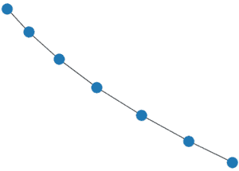
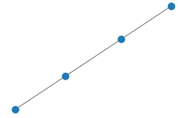
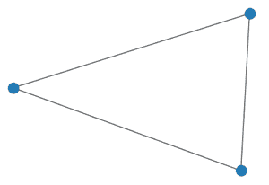
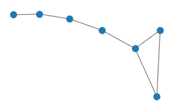

# 使用网络

可视化图形的组成二

> 原文:[https://www . geesforgeks . org/visualizing-composition-two-of-graph-use-networkx/](https://www.geeksforgeeks.org/visualizing-the-composition-two-of-graph-using-networkx/)

在本文中，我们将看到如何使用 networkx 可视化图的组成二。如果给我们两个图 A 和 B，那么它们的组成可以通过对 A 和 B 的节点集和边集进行并运算来找到

简单地说，如果一条边包含在任何初始图的任意两个顶点之间，它将包含在这些图的组合中。

**示例:**

初始图形 G:



G

初始图表 H:



H

G 和 H 的合成结果:


成分(克，氢)

**解释:**如果我们用整数来命名图 G 和 H 中的节点，那么我们将清楚地观察到 G 的节点和边集将是 H 的超集，因此它们的并集给出了 G 作为回报。

**例 2:**

初始图形 G:



G

初始图表 H:


H

G 和 H 的合成结果:



稀有

**说明:**我们可以看到图 G 中的所有边都存在于图 H 中，除了右边第一个和第三个节点之间的节点，因此对 G 和 H 进行合成会将 G 和 H 中的所有边添加到结果中。

**关于合成功能的要点:**

*   h 属性优先于 G 属性。
*   返回的图形与 g 的类型相同。
*   g 和 H 要么都是有向的，要么都是无向的。
*   g 和 H 必须都是图或多重图

**使用 Python 实现合成:**

我们将使用 networkx.compose()函数来完成两个图的合成。

> **语法:**合成(G，H)
> 
> *   **G:** 它是一个 networkx Graph 对象，作为参数传递给组合函数。
> *   **H:** 它也是一个 networkx Graph 对象，作为一个参数传递给组合函数。
> 
> 合成函数的结果将是 G 和 h 的边和顶点集的并集

**进场:**

*   我们将使用别名 nx 导入 networkx。
*   使用 path_graph()函数创建一个示例图形对象 G。
*   使用 path_graph()函数创建第二个示例图形对象 H。
*   然后，我们将调用 compose 函数，传递 G 作为参数。
*   我们将在另一个对象 r 中捕获 compose 函数返回的对象。
*   然后我们将调用 draw()函数，将 R 作为参数传递，这将显示补码图。

**代码:**

## 蟒蛇 3

```py
# importing networkx module 
import networkx as nx 

# creating sample graph object 
G = nx.path_graph(7) 

# creating sample graph object 
H = nx.path_graph(3)

# compose of G and H saving in R
R = nx.compose(G,H) 

# calling draw() to visualize the complement graph 
nx.draw(R) 
```

**输出:**


输出