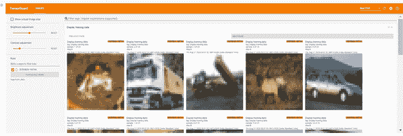
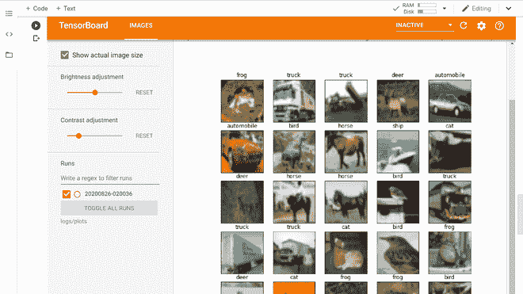
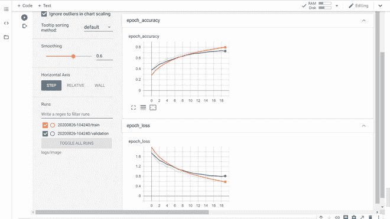
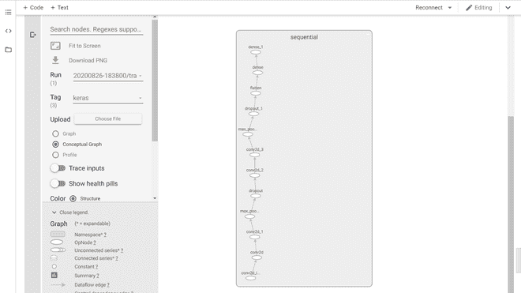
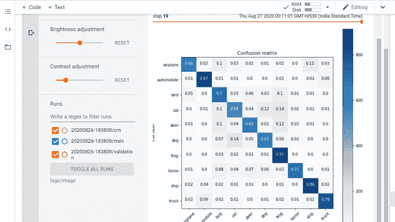

# 用 TensorBoard 可视化训练

> 原文:[https://www . geeksforgeeks . org/visualizing-training-with-tensorboard/](https://www.geeksforgeeks.org/visualizing-training-with-tensorboard/)

在机器学习中，为了改进某些东西，你经常需要能够测量它。TensorBoard 是一个工具，用于提供机器学习工作流程中所需的测量和可视化。它支持跟踪实验指标，如损失和准确性，可视化模型图，将自然语言处理嵌入投影到低维空间，等等。

TensorBoard 提供以下功能:

*   借助不同的图和直方图，可视化不同的指标，如损失、准确性。
*   借助图形可视化模型层和操作。
*   提供训练中涉及的权重和偏差直方图。
*   显示训练数据(图像、音频和文本数据)。

TensorBoard 有以下选项卡:

*   **标量:**此选项卡用于可视化标量指标，如损耗和精度。
*   **图形:**可视化你的模型的计算图，比如表格层和操作中的神经网络模型。
*   **分布:**可视化训练随时间的进展，例如体重/偏差的变化。
*   **直方图:**以三维直方图的形式可视化上述分布。
*   **投影仪:**此选项卡用于可视化自然语言处理的单词嵌入。
*   **图像:**此选项卡用于可视化训练/测试图像数据的内容。
*   **音频:**此选项卡用于可视化音频数据，以用于音频处理等应用
*   **文本:**此选项卡用于可视化音频数据。

**实施:**

*   **加载张量板扩展:**

**代码:**

## 蟒蛇 3

```
# Install it using pip
!pip install -q tf-nightly-2.0-preview

# To load tensorflow extension
import tensorflow as tf
import datetime, os
# location of log directory
logs_base_dir = "./logs"
os.makedirs(logs_base_dir, exist_ok=True)
%tensorboard --logdir {logs_base_dir}
```

*   **绘制训练图像:**

**代码:**

## 蟒蛇 3

```
# Import necessary modules
import numpy as np
import matplotlib.pyplot as plt
import io

# Copy previous logs if any
!rm -rf ./logs/

# Load datasets (Here,we use cifar 10
cifar_10 = tf.keras.datasets.cifar10
(x_train, y_train), (x_test,y_test) = cifar_10.load_data()

# List class Names
class_names =["airplane","automobile","bird","cat","deer",
              "dog","frog","horse", "ship","truck"]

# Data Preprocessing
x_train = x_train.astype('float32')
x_test = x_test.astype('float32')

x_train = x_train/255.0
x_test = x_test/255.0

y_train  = tf.keras.utils.to_categorical(y_train)
y_test  = tf.keras.utils.to_categorical(y_test)

# Creates a directory inside log/train_data folder
# In which we store training images
logdir = "logs/train_data/" + datetime.now().strftime("%Y%m%d-%H%M%S")
# Creates a file writer for the log directory.
file_writer = tf.summary.create_file_writer(logdir)

# write first 25 training images
with file_writer.as_default():
  # Reshape the images because tf.summary expects a 4 dimensional matrices
  # having (batch_size,height, width, color_channels)
  images = np.reshape(x_train[0:25], (-1, 32, 32, 3))
  tf.summary.image("Display training data", images, max_outputs=25, step=0)

# start TensorBoard and display those images (in images tab)
%tensorboard --logdir logs/train_data
```



训练图像

*   **使用 Matplotlib 绘制图像数据:**我们可以看到上面的训练图像并不清晰。这是因为上述训练图像的大小(32，32，3)非常低的分辨率。让我们在 matplotlib 中绘制一些图像。

**代码:**

## 蟒蛇 3

```
# remove old plots data (if any)
!rm -rf logs/plots

logdir = "logs/plots/" + datetime.now().strftime("%Y%m%d-%H%M%S")
file_writer = tf.summary.create_file_writer(logdir)

def plot_to_image(figure):
  """Converts the matplotlib plot to a PNG image and returns it.
  The supplied figure is closed and inaccessible after this call."""
  # Save the plot to a PNG in memory.
  buf = io.BytesIO()
  plt.savefig(buf, format='png')
  # Closing the figure prevents it from being displayed directly inside
  # the notebook.
  plt.close(figure)
  buf.seek(0)
  # Convert PNG buffer to TF image
  image = tf.image.decode_png(buf.getvalue(), channels=4)
  # Add the batch dimension
  print(image.shape)
  image = tf.expand_dims(image, 0)
  return image

def image_grid():
  """Return a 5x5 grid of the training images as a matplotlib figure."""
  # Create a figure to contain the plot.
  figure = plt.figure(figsize=(10,10))
  for i in range(25):
    # create the next subplot with class name as its title
    plt.subplot(5, 5, i + 1, title = class_names[np.int(np.where(y_train[i] ==1)[0])])
    plt.xticks([])
    plt.yticks([])
    plt.grid(False)
    plt.imshow(x_train[i])

  return figure

# Prepare the plot
figure = image_grid()
# Convert to image and log
with file_writer.as_default():
  tf.summary.image("Training data", plot_to_image(figure), step=0)
# start tensorboard and display plot
%tensorboard --logdir logs/plots
```



使用 matplotlib 训练图像

*   **显示培训结果指标:**在本节中，我们将在 TensorBoard 上绘制结果指标。我们将使用标量和图像标签来显示我们的结果。为此，我们将定义一个卷积神经网络模型，并在 CIFAR 10 数据集上对其进行 20 个时期的训练。

**代码:**

## 蟒蛇 3

```
# Define CNN model
model  = tf.keras.models.Sequential([
    tf.keras.layers.Conv2D(32, (3, 3), activation='relu', padding='same', input_shape=(32, 32, 3)),
    tf.keras.layers.Conv2D(32, (3, 3), activation='relu', padding='same'),
    tf.keras.layers.MaxPooling2D((2, 2)),
    tf.keras.layers.Dropout(0.2),
    tf.keras.layers.Conv2D(64, (3, 3), activation='relu', padding='same'),
    tf.keras.layers.Conv2D(64, (3, 3), activation='relu', padding='same'),
    tf.keras.layers.MaxPooling2D((2, 2)),
    tf.keras.layers.Dropout(0.2),
    tf.keras.layers.Flatten(),
    tf.keras.layers.Dense(64, activation='relu'),
    tf.keras.layers.Dense(10, activation='softmax')
])

# Compile CNN model
model.compile(
    optimizer=tf.keras.optimizers.SGD(learning_rate= 0.01 , momentum=0.1),
    loss='categorical_crossentropy',
    metrics=['accuracy']
)
# Print model summary()
model.summary()
```

```
Model: "sequential"
_________________________________________________________________
Layer (type)                 Output Shape              Param #   
=================================================================
conv2d (Conv2D)              (None, 32, 32, 32)        896       
_________________________________________________________________
conv2d_1 (Conv2D)            (None, 32, 32, 32)        9248      
_________________________________________________________________
max_pooling2d (MaxPooling2D) (None, 16, 16, 32)        0         
_________________________________________________________________
dropout (Dropout)            (None, 16, 16, 32)        0         
_________________________________________________________________
conv2d_2 (Conv2D)            (None, 16, 16, 64)        18496     
_________________________________________________________________
conv2d_3 (Conv2D)            (None, 16, 16, 64)        36928     
_________________________________________________________________
max_pooling2d_1 (MaxPooling2 (None, 8, 8, 64)          0         
_________________________________________________________________
dropout_1 (Dropout)          (None, 8, 8, 64)          0         
_________________________________________________________________
flatten (Flatten)            (None, 4096)              0         
_________________________________________________________________
dense (Dense)                (None, 64)                262208    
_________________________________________________________________
dense_1 (Dense)              (None, 10)                650       
=================================================================
Total params: 328,426
Trainable params: 328,426
Non-trainable params: 0
_________________________________________________________________
```

*   现在，我们定义函数来使用测试数据绘制混淆矩阵

**代码:**

## 蟒蛇 3

```
# Code to plot confusion matrix
def plot_confusion_matrix(cm, class_names):
  """
  Returns a matplotlib figure containing the plotted confusion matrix.

  Args:
    cm (array, shape = [n, n]): a confusion matrix of integer classes
    class_names (array, shape = [n]): String names of the integer classes
  """
  figure = plt.figure(figsize=(8, 8))
  plt.imshow(cm, interpolation='nearest', cmap=plt.cm.Blues)
  plt.title("Confusion matrix")
  plt.colorbar()
  tick_marks = np.arange(len(class_names))
  plt.xticks(tick_marks, class_names, rotation=45)
  plt.yticks(tick_marks, class_names)

  # Normalize the confusion matrix.
  cm = np.around(cm.astype('float') / cm.sum(axis=1)[:, np.newaxis], decimals=2)

  # Use white text if squares are dark; otherwise black.
  threshold = cm.max() / 2.
  for i, j in itertools.product(range(cm.shape[0]), range(cm.shape[1])):
    color = "white" if cm[i, j] > threshold else "black"
    plt.text(j, i, cm[i, j], horizontalalignment="center", color=color)

  plt.tight_layout()
  plt.ylabel('True label')
  plt.xlabel('Predicted label')
  return figure
```

*   现在，我们定义 TensorBoard 回调来显示模型预测与测试数据的混淆矩阵。

**代码:**

## 蟒蛇 3

```
logdir = "logs/image/" + datetime.now().strftime("%Y%m%d-%H%M%S")

# Define the basic TensorBoard callback.
tensorboard_callback = tf.keras.callbacks.TensorBoard(log_dir=logdir)
# Create file Writer for Confusion Metrics
file_writer_cm = tf.summary.create_file_writer(logdir + '/cm')
```

*   现在，我们定义函数，将混淆矩阵记录到张量板中。

**代码:**

## 蟒蛇 3

```
# sklearn confusion metrics
from sklearn.metrics import confusion_matrix
import itertools
def log_confusion_matrix(epoch, logs):
  # Use the model to predict the values from the validation dataset.
  test_pred_raw = model.predict(x_test)
  test_pred = np.argmax(test_pred_raw, axis=1)
  y_test_cls = np.argmax(y_test, axis=1)

  # Calculate the confusion matrix.
  cm = confusion_matrix(y_test_cls, test_pred)

  figure = plot_confusion_matrix(cm, class_names=class_names)
  cm_image = plot_to_image(figure)

  # Log the confusion matrix as an image summary.
  with file_writer_cm.as_default():
    tf.summary.image("Confusion Matrix", cm_image, step=epoch)

# Define the per-epoch callback to plot confusion metrics after each epoch.
cm_callback = tf.keras.callbacks.LambdaCallback(on_epoch_end=log_confusion_matrix)
```

**代码:**

## 蟒蛇 3

```
%tensorboard --logdir logs/image
# Train the classifier.
model.fit(
    x_train,
    y_train,
    epochs=20,
    callbacks=[tensorboard_callback, cm_callback],
    validation_data=(x_test, y_test)
)
```



损耗和精度图(标量选项卡)



Keras 模型图(图形选项卡)



混淆矩阵(图像选项卡)

**参考文献:**

*   [TensorBoard 教程](https://www.tensorflow.org/tensorboard/)