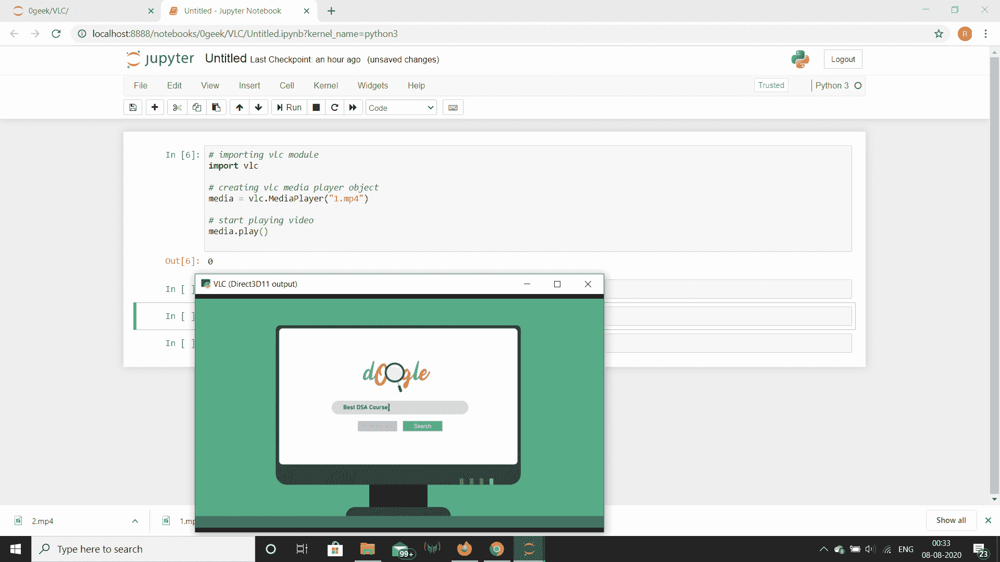

# Python 中的 VLC 模块–简介

> 原文:[https://www . geesforgeks . org/VLC-模块-in-python-an-introduction/](https://www.geeksforgeeks.org/vlc-module-in-python-an-introduction/)

**VLC 媒体播放器**是 VideoLAN 项目开发的免费开源的便携式跨平台媒体播放器软件和流媒体服务器。VLC 适用于桌面操作系统和移动平台，如安卓、iOS、iPadOS、蒂森、Windows 10 Mobile 和 Windows Phone。
我们也可以在 python 的帮助下使用 vlc 媒体播放器，为了在 python 中安装 VLC 模块，我们将使用下面给出的命令

```py
pip install python-vlc
```

**注意:**为了使用 python 中的 vlc 模块，用户系统应该已经在机器上安装了 vlc 媒体播放器。

**导入 VLC 模块:**
要导入 VLC 模块，请使用以下命令

```py
import vlc
```

> **修复导入 vlc 模块时可能出现的错误**
> 1。如果不添加路径，问题是 libvlc.dll 不在路径(系统变量)中。只需将文件 libvlc.dll 路径添加到系统变量中，该文件可以在安装它的 vlc 文件夹中找到
> 2。错误的 vlc 版本，人们经常下载 32 位 VLC 版本。如果我们安装了 64 位版本的 python，这可能会带来一些麻烦。为了解决这个问题，我们只需要重新安装 64 位 vlc 的版本。
> 3。在 vlc 模块之前导入 os 模块，并使用 OS . add _ dll _ directory(r ' c:\ Program Files \ video LAN \ VLC)注册 libvlc.dll。

**示例 1:** 使用 VLC
播放视频

## 蟒蛇 3

```py
# importing vlc module
import vlc

# creating vlc media player object
media = vlc.MediaPlayer("1.mp4")

# start playing video
media.play()
```

**输出:**



**示例 2:** 这里我们将使用 VLC 模块导出视频文件的持续时间。

## 蟒蛇 3

```py
# importing time and vlc
import time, vlc

# method to play video
def video(source):

    # creating a vlc instance
    vlc_instance = vlc.Instance()

    # creating a media player
    player = vlc_instance.media_player_new()

    # creating a media
    media = vlc_instance.media_new(source)

    # setting media to the player
    player.set_media(media)

    # play the video
    player.play()

    # wait time
    time.sleep(0.5)

    # getting the duration of the video
    duration = player.get_length()

    # printing the duration of the video
    print("Duration : " + str(duration))

# call the video method
video("your_video.mp4")
```

**输出:**

```py
Duration : 5006
```