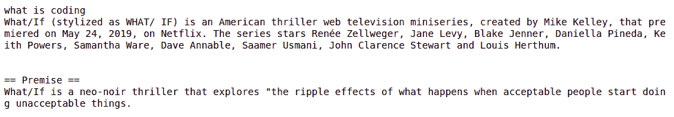

# 使用 Python 语音搜索维基百科

> 原文:[https://www . geesforgeks . org/voice-search-Wikipedia-using-python/](https://www.geeksforgeeks.org/voice-search-wikipedia-using-python/)

每天，我们都会访问如此多的应用程序，无论是像 Messenger、Telegram 这样的消息平台，还是在亚马逊、Flipkart 上订购产品，或者了解天气，列表都可以继续。我们看到，这些网站有自己的软件程序，用于使用规则或人工智能启动与人类的对话。用户通过书面或口头文本经由对话界面与软件程序交互。这可以称为助手。

**示例:**

> **输入:**什么是编码
> 
> **输出:** What/If(风格化为 What/If)是一部美国惊悚网络电视迷你剧，由 Mike Kelley 创作，于 2019 年 5 月 24 日在网飞首映。该系列由蕾妮·齐薇格、简·莱维、布莱克·詹纳、丹妮艾拉·皮内达、凯斯·鲍尔斯、萨曼莎·威尔、戴夫·安纳布尔、萨梅尔·乌斯马尼、约翰·克拉伦斯·斯图尔特和路易斯·赫特哈姆主演。
> 
> == Premise ==
> What/If 是一部新黑色惊悚片，探索“当可接受的人开始做不可接受的事情时，会发生什么的连锁反应。
> 用户:

#### 你想知道什么？

可以使用[自然语言处理(NLP)](https://www.geeksforgeeks.org/introduction-to-natural-language-processing/) 来制作助手，这是人工智能中最有前途的领域之一，它使用自然语言来实现人类与机器的交互。

有两种主要的自然语言处理方法:

*   **rule-based methods: That follow some pre specified rules and answer as per those rules.** *   ****统计方法:******i.e. methods related to machine learning that learn on their own according to user inputs.

本文将学习如何使用统计方法创建自己的助手。

为了创建一个助手，我们将使用 Python 编程语言，因为它拥有构建助手所需的所有模块。其次，Python 很容易理解，即使你没有太多编程经验。

#### 我们开始吧

在进入实际代码之前，我们需要了解，这个聊天机器人或助手将是基于语音的，因此我们需要导入以下模块。

*   **pyttsx3: A python package that supports common text to speech engines on Mac OS, Windows and Linux.** *   ****语音识别:******Library for performing speech recognition, with support for several engines and APIs, like CMU Sphinx, Microsoft Bing Voice Recognition, Google Cloud Speech API etc.
***   wolframalpha:**Python’s support library for WolframAlpha computational intelligence .
***   维基百科:**Python’s library that makes it easy to access and parse data from Wikipedia.

要在系统上安装上述模块，请使用以下方法:

```
pip install pyttsx3
pip install SpeechRecognition
pip install wolframalpha
pip install wikipedia
```

#### 创建 WolframAlpha 帐户

因为，这个聊天机器人使用 WolframAlpha API 来寻找答案，用户必须通过在注册来创建一个免费账户。按照设置免费且仅供个人使用的学生帐户所需的步骤操作。生成您的 app-id 并复制它以供进一步参考。

#### 遵循的概念

***   语音识别:**

***   TTS–文本到语音:**

***   计算知识集成:**

下面是实现。

```
# Python package supporting common text-to-speech engines
import pyttsx3

# For understanding speech
import speech_recognition as sr

# For fetching the answers 
# to computational queries
import wolframalpha

# for fetching wikipedia articles
import wikipedia

# Function to search the query
# that is either entered or spoken
# by user
def search(query):

    # try is used for searching with wolframAlpha
    try:

        # Generate your App ID from WolframAlpha 
        app_id = "Your WolframAlpha App ID here"
        client = wolframalpha.Client(app_id)
        res = client.query(query)
        answer = next(res.results).text
        print(answer)
        SpeakText("Your answer is " + answer)

    # If the query cannot be searched using 
    # WolframAlpha then it is searched in
    # wikipedia
    except:

        query = query.split(' ') 
        query = " ".join(query[0:])

        SpeakText("I am searching for " + query)
        print(wikipedia.summary(query, sentences = 3))
        SpeakText(wikipedia.summary(query, 
                                      sentences = 3))

# Function to convert text to 
# speech 
def SpeakText(command): 

    # Initialize the engine 
    engine = pyttsx3.init() 
    engine.say(command)  
    engine.runAndWait()

# Driver's code
# input query from the user by 
# typing or by voice
query = input()
query = query.lower()

# if query is blank then user 
# is prompted to speak something.
if query == '': 
    r = sr.Recognizer()

    # uses the default microphone
    # as the source to record voice
    with sr.Microphone() as source:  
        print("Say Something ")

        # reduces the background disturbances
        # and noise for 2 seconds
        r.adjust_for_ambient_noise(source, 2)  

        # listening to source
        audio = r.listen(source)  
    try:
        speech = r.recognize_google(audio)
        search(speech)

    # Handling Exceptions if speech 
    # is not understood.
    except sr.UnknownValueError:
        print("Google Speech Recognition could not \
        understand audio")

    # Couldn't handle requests, occurs 
    # mainly because of network errors
    except sr.RequestError as e:  
        print("Could not request results from Google \
        Speech Recognition service;{0}".format(e))
else:
    search(query)

```

**输出:**



**注意:**也生成输出文本的语音输出。****