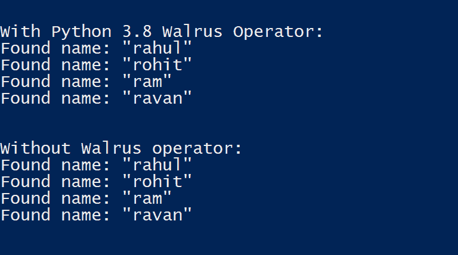

# Python 3.8 中的海象操作符

> 原文:[https://www . geesforgeks . org/walrus-operator-in-python-3-8/](https://www.geeksforgeeks.org/walrus-operator-in-python-3-8/)

Python 3.8 还在开发中。但是已经发布了许多 alpha 版本。Python 3.8 的最新功能之一是海象操作器。在本文中，我们将讨论海象操作符，并用一个例子来解释它。

**简介**

Walrus-operator 是赋值表达式的另一个名称。根据官方文档，这是一种使用符号 NAME := expr 给表达式中的变量赋值的方法。赋值表达式允许在表达式的上下文中，而不是作为独立的语句，将一个值赋给一个变量，甚至是一个尚不存在的变量。

**代码:**

```
a = [1, 2, 3, 4]
if (n := len(a)) > 3:
    print(f"List is too long ({n} elements, expected <= 3)")
```

**输出:**


这里，我们没有在两个地方使用“len(a)”，而是将其分配给一个名为“n”的变量，该变量可以在以后使用。这有助于我们解决代码重复并提高可读性。

**示例–**

让我们借助一个使用 Python 3.7 和 Python 3.8 的例子来更清楚地理解赋值表达式。这里我们有一个名为“sample_data”的字典列表，其中包含了 userId、name 和一个名为 completed 的布尔值。

```
sample_data = [
    {"userId": 1,  "name": "rahul", "completed": False},
    {"userId": 1, "name": "rohit", "completed": False},
    {"userId": 1,  "name": "ram", "completed": False},
    {"userId": 1,  "name": "ravan", "completed": True}
]

print("With Python 3.8 Walrus Operator:") 
for entry in sample_data: 
    if name := entry.get("name"):
        print(f'Found name: "{name}"')

print("Without Walrus operator:")
for entry in sample_data:
    name = entry.get("name")
    if name:
        print(f'Found name: "{name}"')
```

**输出:**
