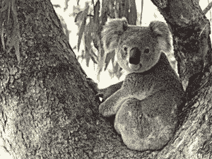
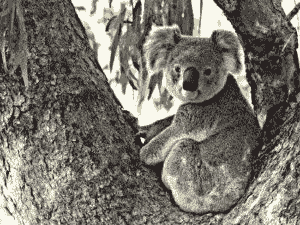

# Python 中的魔杖自适应 _ 锐化()功能

> 原文:[https://www . geesforgeks . org/wand-adaptive _ 锐化-python 中的函数/](https://www.geeksforgeeks.org/wand-adaptive_sharpen-function-in-python/)

**自适应锐化**与普通锐化相似，但唯一的区别是在具有可检测边缘的像素周围更强烈地锐化图像，而在远离边缘的地方不那么强烈。因此，输出图像比正常锐化更清晰。

> **语法:**
> 
> ```py
> wand.image.adaptive_sharpen(radius, sigma, channel)
> 
> ```
> 
> **参数:**
> 
> | 参数 | 输入类型 | 描述 |
> | --- | --- | --- |
> | 半径 | 数字。真实的 | 高斯孔径的大小。 |
> | 希腊字母表中第十八个字母 | 数字，真实的 | 高斯滤波器的标准偏差。 |
> | 频道 | 基绳 | 在特定通道上应用锐化效果。默认情况下为可选和无。 |

**来源影像:**


**Example 1:**

```py
# import Image from wand.image module
from wand.image import Image

# Read image using Image function
with Image(filename ="koala.jpeg") as img:

    # generating sharp image using adaptive_sharpen() function.
    img.adaptive_sharpen(radius = 8, sigma = 4)
    img.save(filename ="askoala.jpeg")
```

**输出:**


**例 2:**
半径和σ的增加值

```py
# import Image from wand.image module
from wand.image import Image

# Read image using Image function
with Image(filename ="koala.jpeg") as img:

    # generating sharp image using adaptive_sharpen() function.
    img.adaptive_sharpen(radius = 20, sigma = 10)
    img.save(filename ="askoala2.jpeg")
```

**输出:**
