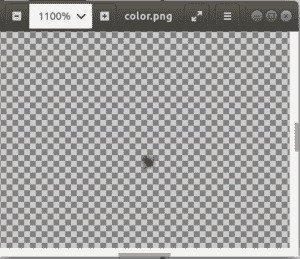

# Python 中的 Wand alpha()函数

> 原文:[https://www . geesforgeks . org/wand-alpha-python 中的函数/](https://www.geeksforgeeks.org/wand-alpha-function-in-python/)

**alpha()** 功能与棒颜色()功能相同。与 color()函数类似，alpha()函数使用当前填充颜色在图像上绘制颜色，从指定位置开始&方法。使用与 color()方法相同的参数。

> **语法:** wand.drawing.alpha(x，y，方法)
> 
> **参数:**
> 
> | 参数 | 输入类型 | 描述 |
> | --- | --- | --- |
> | x | 数字。整数 | 开始灌装 clor |
> | y | 数字。整数 | 灌装结束 |
> | 方法 | 基绳 | 来自 PAINT _ METHOD _ TYPES 的方法 |

以下是油漆方法类型:

*   “点”改变单个像素。
*   用另一种颜色替换另一种颜色。阈值受到模糊的影响。
*   “泛洪填充”填充受绒毛影响的颜色区域。
*   “filltoborder”填充颜色区域，直到边框由 border_color 定义。
*   “重置”将整个图像替换为单一颜色。

**注:**此方法取代 ImageMagick 版中的 matte()。如果试图调用不支持 DrawAlpha 的库，将会引发属性错误。

**示例#1:**

```py
# Import required objects from wand modules
from wand.image import Image
from wand.drawing import Drawing
from wand.color import Color

# generate object for wand.drawing
with Drawing() as draw:
    draw.alpha(100, 100, 'point')
    with Image(width = 200,
               height = 200) as img:

        # draw shape on image using draw() function
        draw.draw(img)
        img.save(filename ='color.png')
```

**输出:**
透明图像中心可见一个像素，这是放大后的图像。


**示例#2:**
使用泛填充算法填充颜色。

```py
# Import required objects from wand modules
from wand.image import Image
from wand.drawing import Drawing
from wand.color import Color

# generate object for wand.drawing
with Drawing() as draw:
    draw.fill_color = Color('blue')
    draw.alpha(10, 35, 'floodfill')
    with Image(width = 200,
               height = 200,
               background = Color('white')) as img:

        # draw shape on image using draw() function
        draw.draw(img)
        img.save(filename ='color2.png')
```

**输出:**
