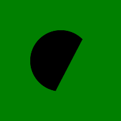

# Python 中的魔杖弧()函数

> 原文:[https://www.geeksforgeeks.org/wand-arc-function-in-python/](https://www.geeksforgeeks.org/wand-arc-function-in-python/)

**arc()** 是 wand.drawing 模块中的一个函数。函数的作用是:在图像中绘制一条弧线。你需要定义三对(x，y)坐标。第一&第二对坐标将是最小边界矩形，最后一对定义开始&结束度。

> **语法:**
> 
> ```
> wand.drawing.arc(start, end, degree)
> ```
> 
> **参数:**
> 
> <figure class="table">
> 
> | 参数 | 输入类型 | 描述 |
> | --- | --- | --- |
> | 开始 | 序列或(数字。真实的数字。真实) | 代表弧的起始 x 和 y 的对。 |
> | 结束 | 序列或(数字。真实的数字。真实) | 代表弧的 x 和 y 端点的对。 |
> | 程度 | 序列或(数字。真实的数字。真实) | 代表开始度和结束度的配对
>  |
> 
> </figure>

**示例#1:**

## 蟒蛇 3

```
# Import required objects from wand modules
from wand.image import Image
from wand.drawing import Drawing
from wand.color import Color

# generate object for wand.drawing
with Drawing() as draw:
    # set stroke color
    draw.stroke_color = Color('black')
    # set width for stroke
    draw.stroke_width = 1
    # fill white color in arc
    draw.fill_color = Color('white')
    draw.arc(( 50, 50),  # Stating point
             ( 150, 150),  # Ending point
             (135, -45))  # From bottom left around to top right
    with Image(width = 100,
               height = 100,
               background = Color('green')) as img:
        # draw shape on image using draw() function
        draw.draw(img)
        img.save(filename ='arc.png')
```

**输出:**



**示例#2:**
**源图像:**


## 蟒蛇 3

```
# Import required objects from wand modules
from wand.image import Image
from wand.drawing import Drawing
from wand.color import Color

# generate object for wand.drawing
with Drawing() as draw:'
    # set stroke color
    draw.stroke_color = Color('black')
    # set width for stroke
    draw.stroke_width = 1
    # fill white color in arc
    draw.fill_color = Color('white')
    draw.arc(( 50, 50),  # Starting point
             ( 150, 150),  # Ending point
             (135, -45))  # From bottom left around to top right
    with Image(filename ="gog.png") as img:
        # draw shape on image using draw() function
        draw.draw(img)
        img.save(filename ='arc.png')
```

**输出:**

