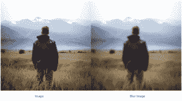
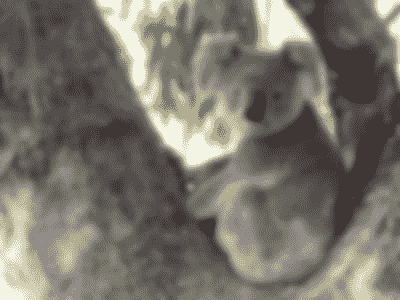

# Python 中的魔杖–模糊()函数

> 原文:[https://www.geeksforgeeks.org/wand-blur-function-in-python/](https://www.geeksforgeeks.org/wand-blur-function-in-python/)

**模糊图像**是指使图像模糊或朦胧。模糊的图像是不确定的，它看不清楚图像。模糊有很多种类型，比如——自适应模糊、高斯模糊、选择性模糊等等。为了模糊图像，我们使用`blur()`功能。`blur()`函数接受三个参数。

**例:**


> **语法:**
> 
> ```py
> wand.image.blur(radius="radius_value", 
>                   sigma="sigma_value",  
>     channel = "optional_channel_value")
> ```
> 
> **参数:**
> 
> | 参数 | 输入类型 | 描述 |
> | --- | --- | --- |
> | 半径 | 数字，真实的 | 的半径，以像素为单位，不计算中心像素。默认值为 0.0。 |
> | 希腊字母表中第十八个字母 | 数字，真实的 | 的标准偏差，以像素为单位。默认值为 0.0。 |
> | 频道 | 基绳 | 应用模糊的可选颜色通道。 |

**示例#1:**

**输入图像–**


```py
# import Image from wand.image module
from wand.image import Image

# read file using Image function
with Image(filename ="koala.jpeg") as img:

    # perform blur effect using blur() function
    img.blur(radius = 0, sigma = 3)

    # save final image
    img.save(filename ="blur_koala.jpeg")
```

**输出:**


**例 2:**

**输入图像–**


```py
# import Image from wand.image module
from wand.image import Image
from wand.display import display

# read file using Image function
with Image(filename ="human1.jpeg") as img:

    # perform blur effect using blur() function
    img.blur(radius = 3, sigma = 4, )

    # save final image
    img.save(filename ="blurhuman.jpeg")
    display(img)
```

**输出:**
