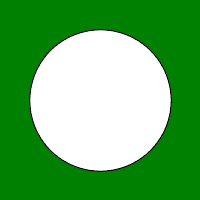

# Python 中的魔杖圆()函数

> 原文:[https://www . geesforgeks . org/wand-circle-function in-python/](https://www.geeksforgeeks.org/wand-circle-function-in-python/)

**圆()**功能是魔杖中的另一个绘图功能。此方法用于在图像中画一个圆。它只需要两个参数，即圆的原点和周长。

> **语法:**棒.画.圆(原点，周长)
> 
> **参数:**
> 
> | 参数 | 输入类型 | 描述 |
> | --- | --- | --- |
> | 起源 | (collections.abc.Sequence)或(Real，numbers。真实) | 代表圆的原点 x 和 y 的对。 |
> | 周长 | (collections.abc.Sequence)或(Real，numbers。真实) | 代表圆的周长 x 和 y 的对 |

**示例#1:**

```py
# Import required objects from wand modules
from wand.image import Image
from wand.drawing import Drawing
from wand.color import Color

# generate object for wand.drawing
with Drawing() as draw:

    # set stroke color
    draw.stroke_color = Color('black')

    # set width for stroke
    draw.stroke_width = 1

    # fill white color in arc
    draw.fill_color = Color('white')
    origin = (100, 100)
    perimeter = (50, 50)

    # draw circle using circle() function
    draw.circle(origin, perimeter) 
    with Image(width = 200,
               height = 200,
               background = Color('green')) as img:

        # draw shape on image using draw() function
        draw.draw(img)
        img.save(filename ='circle.png')
```

**输出:**



**示例#2:**
**输入图像:**


```py
# Import required objects from wand modules
from wand.image import Image
from wand.drawing import Drawing
from wand.color import Color

# generate object for wand.drawing
with Drawing() as draw:
    origin = (100, 100)
    perimeter = (50, 50)

    # set stroke color
    draw.stroke_color = Color('black')

    # set width for stroke
    draw.stroke_width = 1

    # fill white color in arc
    draw.fill_color = Color('white')

    # draw bezier curve using bezier function
    draw.circle(origin, perimeter)
    with Image(filename ="gog.png") as img:

        # draw shape on image using draw() function
        draw.draw(img)
        img.save(filename ='circle2.png')
```

**输出:**
