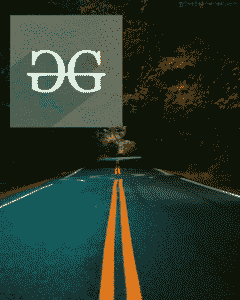

# Python 中的魔杖复合()函数

> 原文:[https://www . geesforgeks . org/wand-composite-function-in-python/](https://www.geeksforgeeks.org/wand-composite-function-in-python/)

**composite()** 函数使用 COMPOSITE_OPERATORS 在绘图主题图像的顶部渲染图像。合成图像必须具有目标顶部、左侧、宽度和高度值。

> **语法:** wand.drawing.composite(图像、左侧、顶部、运算符、参数、重力)
> 
> **参数:**
> 
> | 参数 | 输入类型 | 描述 |
> | --- | --- | --- |
> | 图像 | 墙，图像，图像 | 放置在当前图像上的图像 |
> | 左边的 | 数字。积分 | 将放置图像的 x 坐标 |
> | 顶端 | 数字。积分 | 将放置图像的 y 坐标 |
> | 操作员 | 基绳 | 影响如何将合成应用于图像的操作符。 |
> | 争论 | 基绳 | 作为几何字符串或逗号分隔值给出的附加数字。这是“混合”、“置换”、“溶解”和“调制”运算符所必需的。 |
> | 重力 | 基绳 | 根据重力类型的重力值计算顶部和左侧的值。 |

下面是 COMPOSITE_OPERATORS 的列表:

> (' undefined '，' alpha '，' top '，' blend '，' blur '，' bumpmap '，' change_mask '，' clear '，' color_burn '，' color_dodge '，' color '，' copy_black '，' copy_blue '，' copy_cyan '，' copy _ cyan '，' copy_green '，' copy _ 洋红色'，' copy_alpha '，' copy_red '，' copy _ 黄色'，'变暗'，'变暗 _ 强度'，'差异'，'置换'，'溶解'，'扭曲'，' divide_dst '，' dst _ atop '，' dst '，' dst _

**输入图像:**
**图像#1:**


**图像#2:**


**示例#1:**

```
from wand.image import Image, COMPOSITE_OPERATORS
from wand.drawing import Drawing
from wand.display import display

gog = Image(filename ='gog.png')
road = Image(filename ='rd.jpg')

g = gog.clone()
r = road.clone()
with Drawing() as draw:
    # composite image with color_burn operator
    draw.composite(operator ='color_burn', left = 20, top = 30,
                   width = r.width, height = r.height, image = r)
    draw(g)
    g.save(filename ="colorburn.png")
    display(g)
```

**输出:**


**示例#1:**

```
from wand.image import Image, COMPOSITE_OPERATORS
from wand.drawing import Drawing
from wand.display import display

gog = Image(filename ='gog.png')
road = Image(filename ='rd.jpg')

g = gog.clone()
r = road.clone()
with Drawing() as draw:
    # composite image with dissolve operator
    draw.composite(operator = 'luminize', left = 20, top = 30,
                   width = g.width, height = g.height, image = g)
    draw(r)
    r.save(filename ="dissolve.png")
    display(r)
```

**输出:**
