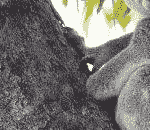

# Python 中的魔杖裁剪()功能

> 原文:[https://www.geeksforgeeks.org/wand-crop-function-in-python/](https://www.geeksforgeeks.org/wand-crop-function-in-python/)

**裁剪**图像是指选择图像的一个区域，并丢弃裁剪区域之外的所有内容。裁剪工具是一个重要的工具，因为它允许我们获得图像的唯一相关部分。此外，有时图像中可能包含一些不需要的内容，可以使用裁剪工具将其从图像中丢弃。
可以使用两种方法进行图像裁剪:

*   使用作物()方法
*   使用切片操作符

## 使用裁剪()方法–

**裁剪()**是魔杖库中的一种内置方法，专门用于对图像执行裁剪操作。让我们继续讨论 crop()函数中的参数。

> **语法:**
> 
> ## 蟒蛇 3
> 
> ```py
> wand.image.crop(left, top, right, bottom, width,
>                   height, reset_coords, gravity)
>  
> # width and right parameter are exclusive each other
> # height and bottom parameter are exclusive each other
> ```
> 
> **参数:**
> 
> <figure class="table">
> 
> | 参数 | 输入类型 | 描述 |
> | --- | --- | --- |
> | 左边的 | 数字。积分 | 裁剪图像的 x 偏移。默认值为 0 |
> | 顶端 | 数字。积分 | 裁剪图像的 y 偏移。默认值为 0 |
> | 正确 | 数字。积分 | 裁剪图像的第二个 x 偏移。默认值为 0 |
> | 底部 | 数字。积分 | 裁剪图像的第二个 y 偏移。默认值为 0 |
> | 宽度 | 数字。积分 | 裁剪图像的宽度。默认值是图像的宽度。该参数和右参数相互排斥。 |
> | 高度 | 数字。积分 | 裁剪图像的高度。默认值是图像的高度。该参数和底部参数相互排斥。 |
> | reset _ coordinates(重置 _ 坐标) | 弯曲件 | 可选标志。如果设置，旋转后，坐标框架将被重新定位到新图像的左上角。默认情况下为真。 |
> | 重力 | 重力类型 | 可选标志。如果设置，将计算顶部和左侧属性。这需要包括宽度和高度参数。 |
> 
> </figure>

*输入图像–*


## 蟒蛇 3

```py
# import Image from wand.image
from wand.image import Image
from wand.display import display

# read image using Image() function
with Image(filename = 'gog.png') as img:

    # crop image using crop() function
    img.crop(50, 50, 190, 170)

    # save resized image
    img.save(filename = 'croped_gog.png')
    display(img)
```

**输出:**


## 使用切片运算符–

执行裁剪操作的另一种方法是使用切片操作符。您可以通过[左:右，上:下]裁剪图像，同时保持原始图像。Slice 运算符用于原始读取文件。

> **语法:**
> 
> ## 蟒蛇 3
> 
> ```py
> with Image(filename = 'filename.format') as img:
>     with img[left:right, top:bottom]  as cropimg:
>     # other manipulation
> ```

*输入图像:*


## 蟒蛇 3

```py
# import Image from wand.image
from wand.image import Image
from wand.display import display

# read image using Image() function
with Image(filename = 'koala.jpeg') as img:

     # cropping image using splitting operator
     with img[100:250, 120:250] as crpimg
         crpimg.save(filename ='crpimg.jpg')

         # display image
         display(crpimg)
```

**输出:**

