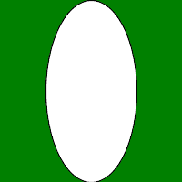
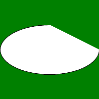

# Python 中的魔杖椭圆()函数

> 原文:[https://www . geesforgeks . org/wand-ellips-python 中的函数/](https://www.geeksforgeeks.org/wand-ellipse-function-in-python/)

**椭圆()**功能用于在图像上绘制椭圆。就像画圆一样，椭圆()函数需要两对点，即原点和椭圆的一对(x，y)半径。若要绘制部分椭圆，请提供一对起始&结束度数作为第三个参数。

> **语法:**
> 
> ```
> wand.drawing.ellipse(origin, radius, rotation)
> ```
> 
> **参数:**
> 
> <figure class="table">
> 
> | 参数 | 输入类型 | 描述 |
> | --- | --- | --- |
> | 起源 | (collections . ABC . sequence)–(numbers。真实的数字。真实) | 代表椭圆原点 x 和 y 的对。 |
> | 半径 | (collections . ABC . sequence)–(numbers。真实的数字。真实) | 代表椭圆的半径 x 和半径 y 的对 |
> | 旋转 | (collections . ABC . sequence)–(numbers。真实的数字。真实) | 代表椭圆起点和终点的对。默认值(0，360) |
> 
> </figure>

**示例#1:**

## 蟒蛇 3

```
# Import required objects from wand modules
from wand.image import Image
from wand.drawing import Drawing
from wand.color import Color

# generate object for wand.drawing
with Drawing() as draw:
    # set stroke color
    draw.stroke_color = Color('black')

    # set width for stroke
    draw.stroke_width = 1

    # fill white color in arc
    draw.fill_color = Color('white')
    origin = (100, 100)
    perimeter = (50, 100)

    # draw circle using circle() function
    draw.ellipse(origin, perimeter)
    with Image(width = 200,
               height = 200,
               background = Color('green')) as img:
        # draw shape on image using draw() function
        draw.draw(img)
        img.save(filename ='ellipse.png')
```

**输出:**



**示例#2:** 使用旋转参数
绘制部分椭圆

## 蟒蛇 3

```
# Import required objects from wand modules
from wand.image import Image
from wand.drawing import Drawing
from wand.color import Color

# generate object for wand.drawing
with Drawing() as draw:
    # set stroke color
    draw.stroke_color = Color('black')

    # set width for stroke
    draw.stroke_width = 1

    # fill white color in arc
    draw.fill_color = Color('white')
    origin = (100, 100)
    perimeter = (100, 50)
    rotation = (0, 270)

    # draw circle using circle() function
    draw.ellipse(origin, perimeter, rotation)
    with Image(width = 200,
               height = 200,
               background = Color('green')) as img:
        # draw shape on image using draw() function
        draw.draw(img)
        img.save(filename ='ellipsepartial.png')
```

**输出:**

