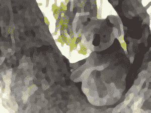

# Python 中的魔杖图像–base image . kuwahara()函数

> 原文:[https://www . geesforgeks . org/wand-image-base image-kuwahara-function-in-python/](https://www.geeksforgeeks.org/wand-image-baseimage-kuwahara-function-in-python/)

**Kuwahara** 是图像处理中最著名、最重要的效果之一。 **kuwahara()** 功能用于给图像添加 kuwahara 效果。kuwahara()方法应用平滑滤波器来减少图像中的噪声，但也保留边缘。kuwahara()函数只接受两个参数。

> **语法:**
> 
> ```py
> wand.image.kuwahara(radius=*radius*, sigma= *std.deviation*)
> ```
> 
> **参数:**
> 
> | 参数 | 输入类型 | 描述 |
> | --- | --- | --- |
> | 半径 | 数字。真实的 | 过滤器孔径的大小。 |
> | 希腊字母表中第十八个字母 | 数字。真实的 | 高斯滤波器的标准差。 |

**所用图像:**


**示例#1:**

```py
# import Image from wand.image module
from wand.image import Image

# read image using Image() function
with Image(filename ="koala.jpeg") as img:

    # apply kuwahara effect using kuwahara() function
    img.kuwahara(radius = 2, sigma = 1.5)
    img.save(filename ="koalakuwahara.jpg")
```

**输出:**


**示例#2:** 增加半径和σ

```py
# import Image from wand.image module
from wand.image import Image

# read image using Image() function
with Image(filename ="koala.jpeg") as img:

    # apply kuwahara effect using kuwahara() function
    img.kuwahara(radius = 4, sigma = 3)
    img.save(filename ="koalakuwahara.jpg")
```

**输出:**
