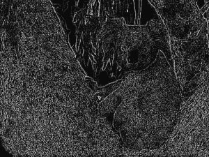

# Python 中的 Wand image.edge 函数

> 原文:[https://www . geesforgeks . org/wand-image-edge-function-in-python/](https://www.geeksforgeeks.org/wand-image-edge-function-in-python/)

**边缘提取**是一种效果，之后图像中存在的边缘被突出显示。这样做是为了检测图像中存在的所有边缘。edge()函数使用简单的卷积滤波器突出黑白图像上的边缘。一般来说，边缘检测用于计算机视觉和机器学习。

> **语法:**
> 
> ```
> wand.image.edge(radius=*radius*)** 
> ```
> 
> **参数:**
> 
> | 参数 | 输入类型 | 描述 |
> | --- | --- | --- |
> | 半径 | 数字。真实的 | 的半径，以像素为单位，不计算中心像素。 |

**所用图像:**


**Example #1:**

```
# import Image from wand.image module
from wand.image import Image

# read image using Image() function
with Image(filename ="koala.jpeg") as img:
    # transform image to grayscale image
    img.transform_colorspace('gray')

    # edge extraction using edge() function
    img.edge(1)
    img.save(filename ="edgekoala.jpeg")
```

**输出:**


**示例#:** 增加半径值。

```
# import Image from wand.image module
from wand.image import Image

# read image using Image() function
with Image(filename ="koala.jpeg") as img:

    # transform image to grayscale image
    img.transform_colorspace('gray')

    # edge extraction using edge() function
    img.edge(3)
    img.save(filename ="edgekoala.jpeg")
```

**输出:**
