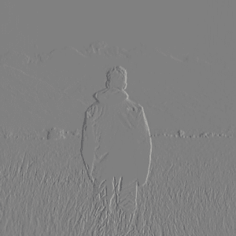
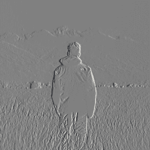

# Python 中的魔杖图像浮雕

> 原文:[https://www.geeksforgeeks.org/wand-image-emboss-in-python/](https://www.geeksforgeeks.org/wand-image-emboss-in-python/)

**浮雕**效果类似于边缘提取，但更像是 3d 效果。浮雕的传统用途是通过在图层的不同部分添加高光和阴影来使事物看起来更加立体。为了生成浮雕图像，我们使用了魔杖中的浮雕功能。类似于 edge()函数，浮雕()函数给出了灰度图像的最佳效果。

> **语法:**
> 
> ```py
> wand.image.emboss(radius=*radius*, sigma=*std. deviation*)
> 
> ```
> 
> **参数:**
> 
> | 参数 | 输入类型 | 描述 |
> | --- | --- | --- |
> | 半径 | 数字。整数 | 的半径，以像素为单位，不计算中心像素。 |
> | 希腊字母表中第十八个字母 | 数字。真实的 |

Standard deviation used

**所用图像:**


**Example #1:**

```py
# import Image from wand.image module
from wand.image import Image

# read image using Image function
with Image(filename ="frameman.jpeg") as img:

    # generate a grayscale image
    img.transform_colorspace('gray')

    # GENERATE EMBOSS IMAGE
    img.emboss(radius = 3.0, sigma = 1.75)

    # SAVE FINAL IMAGE
    img.save(filename ="manemboss.jpeg")
```

**输出:**


**例 2:**
增加半径和σ值。

```py
# import Image from wand.image module
from wand.image import Image

# read image using Image function
with Image(filename ="frameman.jpeg") as img:

    # generate a grayscale image
    img.transform_colorspace('gray')

    # GENERATE EMBOSS IMAGE
    img.emboss(radius = 10, sigma = 3)

    # SAVE FINAL IMAGE
    img.save(filename ="manemboss.jpeg")
```

**输出:**
