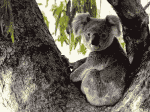
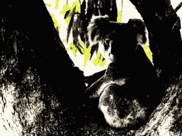

# Python 中的魔杖等级()函数

> 原文:[https://www . geesforgeks . org/wand-level-function-in-python/](https://www.geeksforgeeks.org/wand-level-function-in-python/)

**level()** 功能控制图像的黑白边界。与 gamma()方法类似，可以使用 gamma 关键字参数调整中点级别。黑点和白点参数需要 0.0 & 1.0 之间的值，代表百分比。

> **语法:**
> 
> ```py
> wand.image.evaluate(operator, value, channel)
> ```
> 
> **参数:**
> 
> <figure class="table">
> 
> | 参数 | 输入类型 | 描述 |
> | --- | --- | --- |
> | 黑色 | 数字。真实的 | 黑点，占系统量子范围的百分比。默认为 0.. |
> | 白色 | 数字。真实的 | 白点，占系统量子范围的百分比。默认为 1.0。
>  |
> | 微克 | 数字。真实的 | 可选伽马调节。值> 1.0 在值为< 1.0 darken them. 
> 时使图像的中间色调变亮 |
> | 频道 | 基绳 | 渠道类型。
>  |
> 
> </figure>

**例 1:**
**源图像:**


## 蟒蛇 3

```py
# Import Image from wand.image module
from wand.image import Image

# Read image using Image function
with Image(filename ="koala.jpeg") as img:
    img.level(0.2, 0.9, gamma = 1.1)
    img.save(filename ="kl-level.jpeg")
```

**输出:**



**例 2:**
增加黑白值到 0.5 和 0.7。

## 蟒蛇 3

```py
# Import Image from wand.image module
from wand.image import Image

# Read image using Image function
with Image(filename ="koala.jpeg") as img:
    img.level(0.5, 0.7, gamma = 1.1)
    img.save(filename ="kl-level2.jpeg")
```

**输出:**

