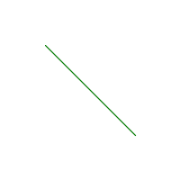

# Python 中的 Wand line()函数

> 原文:[https://www.geeksforgeeks.org/wand-line-function-in-python/](https://www.geeksforgeeks.org/wand-line-function-in-python/)

**line()** 是 wand.drawing 模块中的另一个绘图功能。顾名思义 line()函数是用来在图像中画一条线的。line()函数只需要两个参数，它们是我们要画的线的起点和终点。

> **语法:**
> 
> ```
> wand.drawing.line(start, end)
> ```
> 
> **参数:**
> 
> <figure class="table">
> 
> | 参数 | 输入类型 | 描述 |
> | --- | --- | --- |
> | 开始 | 序列或(数字。整数，数字。积分) | 代表弧的起始 x 和 y 的对。 |
> | 结束 | 序列或(数字。整数，数字。积分) | 代表弧的 x 和 y 端点的对。 |
> 
> </figure>

**示例#1:**

## 蟒蛇 3

```
# Import required objects from wand modules
from wand.image import Image
from wand.drawing import Drawing
from wand.color import Color

# generate object for wand.drawing
with Drawing() as draw:
    # set stroke color
    draw.stroke_color = Color('green')
    # set width for stroke
    draw.stroke_width = 1
    draw.line(( 50, 50),  # Stating point
             ( 150, 150))  # Ending point
    with Image(width = 200,
               height = 200,
               background = Color('white')) as img:
        # draw shape on image using draw() function
        draw.draw(img)
        img.save(filename ='line.png')
```

**输出:**



**示例#2:** 在预先存在的图像上绘制一条线。
**来源图片:**


## 蟒蛇 3

```
# Import required objects from wand modules
from wand.image import Image
from wand.drawing import Drawing
from wand.color import Color

# generate object for wand.drawing
with Drawing() as draw:
    # set stroke color
    draw.stroke_color = Color('white')

    # set width for stroke
    draw.stroke_width = 1
    with Image(filename = "gog.png") as img:
        draw.line((( img.height)/2, 0),  # Stating point
                   ( 0, (img.width)/2))  # Ending point

        # draw shape on image using draw() function
        draw.draw(img)
        img.save(filename ='line2.png')
```

**输出:**

