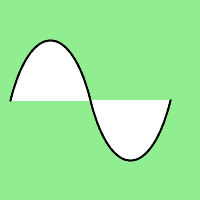

# Python 中的 Wand path_curve()函数

> 原文:[https://www . geesforgeks . org/wand-path _ curve-function-in-python/](https://www.geeksforgeeks.org/wand-path_curve-function-in-python/)

**path_curve()** 是专门为路径引入的函数。path_curve()在控制点的帮助下，绘制一条从图像的目的点到特定点(x，y)的三次贝塞尔曲线。

> **语法:**
> 
> ```py
> wand.drawing.path_curve(to, controls, smooth, relative)
> ```
> 
> **参数:**
> 
> <figure class="table">
> 
> | 参数 | 输入类型 | 描述 |
> | --- | --- | --- |
> | 到 | 序列或(数字。真实的数字。真实) | 表示要绘制到的坐标的对。 |
> | 控制 | collections . ABC . sequence or(numbers。真实的数字。真实) | 用于影响曲线的坐标 |
> | 光滑的 | 弯曲件 | 假设最后定义的控制坐标 |
> | 亲戚 | 弯曲件 | 将给定坐标视为相对于当前点。 |
> 
> </figure>

**示例#1:**

## 蟒蛇 3

```py
from wand.image import Image
from wand.drawing import Drawing
from wand.color import Color

with Drawing() as draw:
    draw.stroke_width = 2
    draw.stroke_color = Color('black')
    draw.fill_color = Color('white')
    draw.path_start()
    # Start middle-left
    draw.path_move(to =(10, 100))
    # Curve across top-left to center
    draw.path_curve(to =(80, 0),
                    controls =[(20, -80), (60, -80)],
                    relative = True)
    # Continue curve across bottom-right
    draw.path_curve(to =(80, 0),
                    controls =(60, 80),
                    smooth = True,
                    relative = True)
    draw.path_finish()
    with Image(width = 200, height = 200, background = Color('lightgreen')) as image:
        draw(image)
        image.save(filename ="pathcurve.png")
```

**输出:**

