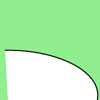

# Python 中的魔杖路径 _ 椭圆 _ 弧()函数

> 原文:[https://www . geesforgeks . org/wand-path _ 椭园 _ arc-python 中的函数/](https://www.geeksforgeeks.org/wand-path_elliptic_arc-function-in-python/)

**path _ 椭圆 _ 弧()**是专门为路径引入的函数。path _ 椭园 _arc()从当前点绘制一个椭圆弧到我们希望弧绘制到的特定点。
让我们看看这个函数需要的参数。

> **语法:**
> 
> ```py
> wand.drawing.path_elliptic_arc(to, radius, rotation, large_arc, clockwise, relative)
> ```
> 
> **参数:**
> 
> <figure class="table">
> 
> | 参数 | 输入类型 | 描述 |
> | --- | --- | --- |
> | 到 | 序列或(数字。真实的数字。真实) | 表示要绘制到的坐标的对。 |
> | 半径 | collections . ABC . sequence or(numbers。真实的数字。真实) | 表示要绘制的椭圆半径的对。 |
> | 辐状的 | 弯曲件 | x 轴上旋转椭圆的角度。 |
> | 大弧 | 弯曲件 | 绘制最大可用弧。 |
> | 顺时针方向的 | 弯曲件 | 从起点到目标顺时针绘制圆弧路径。 |
> | 亲戚 | 弯曲件 | 将给定坐标视为相对于当前点。 |
> 
> </figure>

**示例:**画一条椭圆曲线。

## 蟒蛇 3

```py
from wand.image import Image
from wand.drawing import Drawing
from wand.color import Color

with Drawing() as draw:
    draw.stroke_width = 2
    draw.stroke_color = Color('black')
    draw.fill_color = Color('white')
    draw.path_start()
    # Start middle-left
    draw.path_move(to =(10, 100))
    # draw elliptical curve
    draw.path_elliptic_arc(to =(10, 180),
                           radius = (20, 40),
                           rotation = 270,
                           large_arc = True,
                           clockwise = True,
                           relative = True )
    with Image(width = 200, height = 200, background = Color('lightgreen')) as image:
        draw(image)
        image.save(filename ="pathcurve.png")
```

**输出:**

