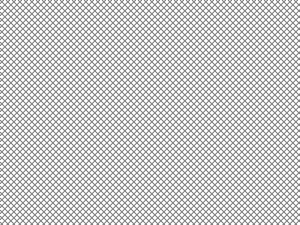

# 墙壁伪像——python

> 哎哎哎:# t0]https://www . geeksforgeeks . org/wall 伪图像 python/

Wand 支持许多图像格式规范，这些规范是用 soem 算法创建的一些图像。伪图像非常重要，我们可以在魔杖中使用伪图像对图像进行各种操作。我们可以通过在`Image()`功能中设置伪参数来创建伪图像。

> **我们可以进行的一些操作–**
> 
> 1.创建纯色图像。
> 2。创建渐变图像。
> 3。创建带有图案的图像
> 4。创建分形图像。

**一些重要的伪像:**

| 伪图像 | 描述 |
| --- | --- |
| “画布:颜色”，或“xc:颜色” | 用纯色创建图像，这里 color 是颜色值字符串 |
| 标题:TEXT ' | 向图像添加文本 |
| 梯度:开始-结束' | 在两种颜色之间生成混合渐变，其中开始和结束都是颜色值字符串。 |
| 哈尔德:' | 创建高低维矩阵表。 |
| '内联:值' | 其中 VALUE 是数据 url / base64 字符串值.. |
| 「标示:文字」 | 其中 TEXT 是字符串消息。 |
| 模式:LABEL ' | 生成具有重复图案的图像。 |
| 等离子体:' | 生成等离子体分形图像 |
| '径向梯度' | 这和渐变是一样的，但是在这里有一个圆形的颜色混合。 |
| 平铺:FILENAME ' | 从给定的图像生成重复的平铺效果，其中 FILENAME 是源图像的路径.. |

**语法:**

```
with Image(width=image_width, height=image_height,
                     pseudo='pseudo_type') as img:
    # other manipulation code

```

现在让我们继续讨论伪像的 python 代码。

**示例 1:** 创建具有渐变的图像

```
# Import Image from wand.image module
from wand.image import Image

# Create pseudo image using Image() function
with Image(width = 400, height = 300, 
        pseudo ='gradient:# 32a852-# 09e846') as img:

    # Save image with a validfilename
    img.save(filename ='gradient.png')
```

**输出:
**

****示例 2:** 用图案**

 **```
# Import Image from wand.image module
from wand.image import Image

# Create image using Image() and label CROSSHATCH45 for pattern
with Image(width = 100, height = 100, pseudo ='pattern:CROSSHATCH45') as img:

    # Save image
    img.save(filename ='pattern.png')
```** 创建图像

