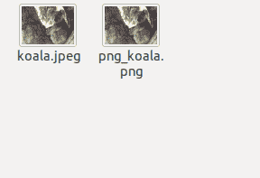

# 魔杖蟒蛇–介绍和安装

> 原文:[https://www . geesforgeks . org/wand-python-introduction-and-installation/](https://www.geeksforgeeks.org/wand-python-introduction-and-installation/)

**Imagemagick** 是为将图像从一种格式转换为另一种格式而开发的工具。由于多种多样的图像格式及其精确和简单的工作方式，它拥有巨大的社区支持。我们可以从 pdf 文件中获取图像。
**魔杖**是 **Imagemagick** 为蟒蛇开发的绑定。wWand 打开并操作图像。魔杖为图像处理提供了大量的功能。

**魔杖库的用途:**
1。读/写不同格式的图像
2。将图像从一种形式转换成另一种形式
3。缩放和裁剪
4。给图像添加简单的效果
5。为图像添加特殊效果
6。变换图像
7。其他颜色增强

**安装:**
**使用 pip:**
魔杖可以通过运行轻松安装

```
$ pip install Wand
```

在终端或命令提示符下。

**在 Linux 上安装:**
我们可以通过运行下面的命令在 Linux 上安装 Wand

```
sudo apt-get install libmagickwand-dev
```

如果我们需要 SVG、WMF、OpenEXR、DjVu 和 Graphviz 支持，我们还必须安装 libmagickcore5-extra，要安装 libmagickcore5-extra run，

```
sudo apt-get install libmagickcore5-extra
```

在你的终端。

**在 Mac 上安装:**
我们可以通过使用 *brew* 命令简单地安装魔杖，如下所示

```
 brew install imagemagick
```

在终点站。

**Windows 上的安装:**
你可以自己构建 ImageMagick，但是需要像 Visual Studio 这样的构建工具链来编译。最简单的方法就是为您的架构(win32 或 win64)下载 ImageMagick 的预构建二进制文件。你可以从[这里](https://imagemagick.org/script/download.php#windows)下载。

下面是 Wand 库的一个简单用例示例，我们编写 python 代码将图像从 jpeg 格式转换为 png
**示例:**

```
from __future__ import print_function
from wand.image import Image

with Image(filename ='koala.jpeg') as img:
    with img.convert('png') as converted:
        converted.save(filename ='png_koala.png')
```

**输出:**
