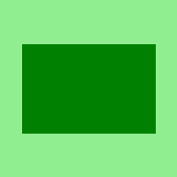
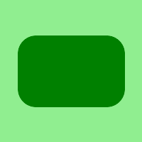

# Python 中的魔杖矩形()函数

> 原文:[https://www . geesforgeks . org/wand-矩形-python 中的函数/](https://www.geeksforgeeks.org/wand-rectangle-function-in-python/)

**rectangle()** 函数，顾名思义这个函数是用来用 Python 中的 wand.drawing 对象画圆的。矩形有很多参数，如左、上、右、下、宽、高等。

> **语法:** wand.drawing.rectangle(左、上、右、下、宽、高、半径、半径、旋转)
> 
> **参数:**
> 
> | 参数 | 输入类型 | 描述 |
> | --- | --- | --- |
> | 左边的 | 数字。真实的 | x-要绘制的矩形的偏移量。 |
> | 顶端 | 数字。真实的 | 要绘制的矩形的 y 偏移。 |
> | 正确 | 数字。真实的 | 要绘制的矩形的第二个 x 偏移量。该参数和宽度参数相互排斥。 |
> | 底部 | 数字。真实的 | 要绘制的矩形的第二个 y 偏移。该参数和高度参数相互排斥。 |
> | 宽度 | 数字。真实的 | 要绘制的矩形的宽度。该参数和右参数相互排斥。 |
> | 高度 | 数字。真实的 | 要绘制的矩形的高度。该参数和底部参数相互排斥。 |
> | 半径 | 数字。真实的 | 拐角处。这是设置 xradius 和 yradius 的捷径。 |
> | 异径辐射 | 数字。真实的 | 水平方向的半径角.. |
> | 半径(radius) | 数字。真实的 | 垂直方向上的旋转角。 |

**示例#1:**

```py
# Import different modules of wand
from wand.image import Image
from wand.drawing import Drawing
from wand.color import Color
import math

with Drawing() as draw:
    draw.fill_color = Color('GREEN')
    draw.rectangle(left = 25, top = 50, 
                   right = 175, bottom = 150)

    with Image(width = 200, height = 200, background = Color('lightgreen')) as image:
        draw(image)
        image.save(filename = "rectangle.png")
```

**输出:**


**示例#2:**
设置矩形的角半径。

```py
# Import different modules of wand
from wand.image import Image
from wand.drawing import Drawing
from wand.color import Color
import math

with Drawing() as draw:
    draw.fill_color = Color('GREEN')
    draw.rectangle(left = 25, top = 50, right = 175,
                          bottom = 150, radius = 25)

    with Image(width = 200, height = 200, background = Color('lightgreen')) as image:
        draw(image)
        image.save(filename = "rectangle.png")
```

**输出:**
