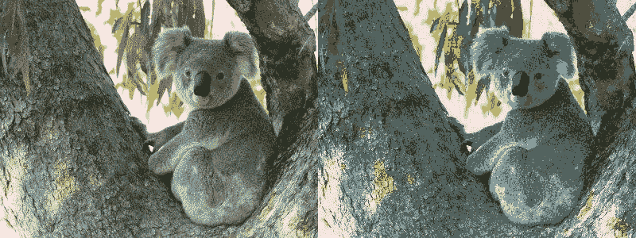
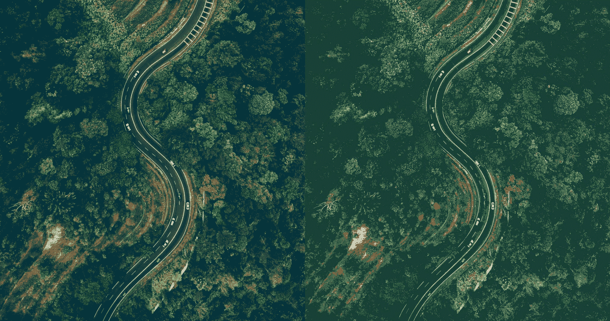

# Python 中的魔杖重映射()函数

> 原文:[https://www . geesforgeks . org/wand-remap-function-in-python/](https://www.geeksforgeeks.org/wand-remap-function-in-python/)

**重映射效果**用相似性参考图像中找到的最接近的匹配像素替换所有像素。**重新映射()**用给定相似度图像中最接近的颜色重建图像调色板。

> **语法:** wand.image.remap(亲缘关系，方法)
> 
> **参数:**
> 
> | 参数 | 输入类型 | 描述 |
> | --- | --- | --- |
> | 吸引力 | 映像库 | 参考图像。 |
> | 方法 | 基绳 | 抖动方法。请参见抖动方法。默认为“否”抖动。 |

**输入图像:**


**例 1:**

```py
# Import Image from wand.image module
from wand.image import Image

with Image(filename ="koala.jpeg") as left:
    with left.clone() as right:
        with Image(width = 100, height = 1, pseudo ="plasma:") as affinity:

            # remap image using remap() function
            right.remap(affinity)
        left.extent(width = left.width * 2)

        # adding remaped image with original image
        left.composite(right, top = 0, left = right.width)
    left.save(filename ="remapk.jpeg")
```

**输出:**



**输入图像:**


**例 2:**

```py
# Import Image from wand.image module
from wand.image import Image

with Image(filename ="road.jpeg") as left:
    with left.clone() as right:
        with Image(width = 100, height = 1, pseudo ="plasma:") as affinity:

            # remap image using remap() function
            right.remap(affinity)
        left.extent(width = left.width * 2)

        # adding remaped image with original image
        left.composite(right, top = 0, left = right.width)
    left.save(filename ="roadr.jpeg")
```

**输出:**

