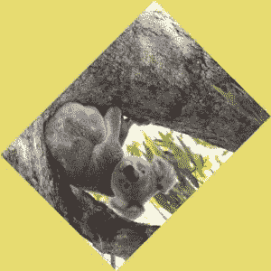

# Python 中的魔杖旋转()功能

> 原文:[https://www . geesforgeks . org/wand-rotate-function-in-python/](https://www.geeksforgeeks.org/wand-rotate-function-in-python/)

**旋转**改变图像的方向或将图像旋转到特定的角度。**旋转()**的度数可以是 0 到 359。(实际上你可以通过 360、361 或更多，但分别等于 0、1 或更多。).

> **语法:**
> 
> ```py
> wand.image.rotate(degree, background, reset_coords)
> ```
> 
> **参数:**
> 
> <figure class="table">
> 
> | 参数 | 输入类型 | 描述 |
> | --- | --- | --- |
> | 程度 | 数字。真实的 | 旋转的角度。360 的倍数没有影响 |
> | 背景 | 魔杖。颜色。颜色 | 可选的背景颜色。默认值是透明的。 |
> | reset _ coordinates(重置 _ 坐标) | 弯曲件 | 可选标志。如果设置，旋转后，坐标框架将被重新定位到新图像的左上角。默认情况下为真。 |
> 
> </figure>

**来源图片:**


**例 1:**

## 蟒蛇 3

```py
# Import Image from wand.image module
from wand.image import Image

with Image(filename ="koala.jpeg") as img:
    with img.clone() as rotated:
        # rotate image using rotate() function
        rotated.rotate(90)
        rotated.save(filename ='transform-rotated-90.jpg')
```

**输出:**


**例 2:**

## 蟒蛇 3

```py
# Import Image from wand.image module
from wand.image import Image
from wand.color import Color

with Image(filename ="koala.jpeg") as img:
    with img.clone() as rotated:
        # rotate image using rotate() function
        rotated.rotate(135, background = Color('rgb(229, 221, 112)'))
        rotated.save(filename ='transform-rotated-135.jpg')
```

**输出:**

