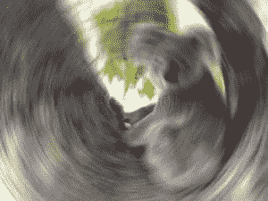
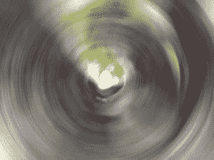

# Python 中的魔杖旋转 _ 模糊()函数

> 原文:[https://www . geesforgeks . org/wand-rotary _ blur-function-in-python/](https://www.geeksforgeeks.org/wand-rotational_blur-function-in-python/)

另一种可以在魔杖 python 库中执行的模糊类型是旋转模糊。旋转模糊与运动模糊非常相似，但在这种情况下，模糊的运动是圆形的。**rotary _ blur()**功能模糊图像中心周围半径内的图像。与其他模糊方法不同，没有半径或西格玛参数。

> **语法:**
> 
> ```py
> wand.image.rotational_blur( angle= angle_value,
>                            channel = "optional_channel_value")
> # radius should always be greater than sigma(standard deviation)
> ```
> 
> **参数:**
> 
> | 参数 | 输入类型 | 描述 |
> | --- | --- | --- |
> | 角 | 基绳 | 模糊旋转的度数。 |
> | 频道 | 数字。真实的 | 对其应用效果的可选通道。 |

**所用图像:**


**Example #1:**

```py
# import display() to show final image
from wand.display import display

# import Image from wand.image module
from wand.image import Image

# read file using Image function
with Image(filename ="koala.jpeg") as img:

    # perform adaptive blur effect using adaptive_blur() function
    img.rotational_blur(angle = 10)

    # save final image
    img.save(filename ="rb_koala.jpeg")

    # display final image
    display(img)
```

**输出:**


**例 2:** 将角度增加到 30°。

```py
# import display() to show final image
from wand.display import display

# import Image from wand.image module
from wand.image import Image

# read file using Image function
with Image(filename ="koala.jpeg") as img:

    # perform adaptive blur effect using adaptive_blur() function
    img.rotational_blur(angle = 30)

    # save final image
    img.save(filename ="gb_koala.jpeg")

    # display final image
    display(img)
```

**输出:**
