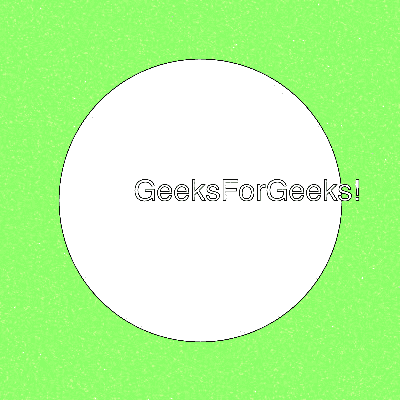

# 魔杖草图()功能–Python

> 原文:[https://www.geeksforgeeks.org/wand-sketch-function-python/](https://www.geeksforgeeks.org/wand-sketch-function-python/)

**草图()**函数是 Python Wand ImageMagick 库中的一个内置函数，用于模拟铅笔草图效果。

> **语法:**
> 
> 草图(半径、σ、角度)
> 
> **参数:**该函数接受三个参数，如上所述，定义如下:
> 
> *   **半径:**该参数存储模拟图像的半径。
> *   **σ:**该参数存储模拟图像的σ。
> *   **角度:**该参数存储模拟的角度。
> 
> **返回值:**该函数返回魔杖图像图像对象。

**原图:**


**例 1:**

## 蟒蛇 3

```py
# Import library from Image
from wand.image import Image

# Import the image
with Image(filename ='../geeksforgeeks.png') as image:
    # Clone the image in order to process
    with image.clone() as sketch:
        # Invoke sketch function
        sketch.sketch(15, 5, 10)
        # Save the image
        sketch.save(filename ='sketch1.jpg')
```

**输出:**


**例 2:**

## 蟒蛇 3

```py
# Import libraries from the wand 
from wand.image import Image
from wand.drawing import Drawing
from wand.color import Color

with Drawing() as draw:
    # Set Stroke color the circle to black
    draw.stroke_color = Color('black')
    # Set Width of the circle to 2
    draw.stroke_width = 1
    # Set the fill color to 'White (# FFFFFF)'
    draw.fill_color = Color('white')

    # Invoke Circle function with center at 50, 50 and radius 25
    draw.circle((200, 200), # Center point
                (100, 100)) # Perimeter point
    # Set the font style
    draw.font = '../Helvetica.ttf'
    # Set the font size
    draw.font_size = 30

    with Image(width = 400, height = 400, background = Color('# 45ff33')) as pic:
        # Set the text and its location
        draw.text(int(pic.width / 3), int(pic.height / 2), 'GeeksForGeeks !')
        # Draw the picture
        draw(pic)
        # Invoke sketch function method
        pic.sketch(10, 2, 15)
        # Save the image
        pic.save(filename ='sketch2.jpg')
```

**输出:**

