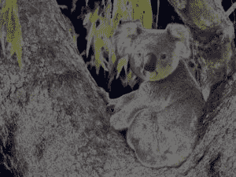
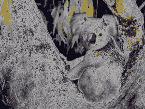

# Python 中的魔杖日晒()功能

> 原文:[https://www . geesforgeks . org/wand-solarize-function-in-python/](https://www.geeksforgeeks.org/wand-solarize-function-in-python/)

**日晒效果**是在相机中摄影胶片极度过度曝光的情况下观察到的色调反转效果。最有可能的是，这种效应最早是在包括太阳在内的风景照片中观察到的。太阳不是图像中最白的地方，而是变成了黑色或灰色。 **solarize()** 函数通过用否定值替换定义阈值以上的像素值，在图像上创建“烧毁”效果。

> **语法:**
> 
> ```
> wand.image.solarize(amount, method)
> 
> ```
> 
> **参数:**
> 
> | 参数 | 输入类型 | 描述 |
> | --- | --- | --- |
> | 阈值 | 数字。真实的 | 介于 0.0 和 quantum_range 之间。/td>
>  |
> | 频道 | 基绳 | 目标可选颜色通道。参见通道
>  |

**来源影像:**


**例 1:**

```
# Import Image from wand.image module
from wand.image import Image

# Read image using Image function
with Image(filename ="koala.jpeg") as img:

    # solarized image using solarize() function
    img.solarize(threshold = 0.5 * img.quantum_range)
    img.save(filename ="solpkoala.jpeg")
```

**输出:**


**例 2:**
降低阈值。

```
# Import Image from wand.image module
from wand.image import Image

# Read image using Image function
with Image(filename ="koala.jpeg") as img:

    # solarized image using solarize() function
    img.solarize(threshold = 0.25 * img.quantum_range)
    img.save(filename ="impkoala2.jpeg")
```

**输出:**
