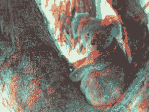

# Python 中的魔杖立体图()功能

> 原文:[https://www . geesforgeks . org/wand-stereogram-function-in-python/](https://www.geeksforgeeks.org/wand-stereogram-function-in-python/)

**立体图效果**是在图像内部生成图像的效果。立体图是图片中的图片。隐藏在每幅图像中的是一个物体，当正确观看时，它会以三维形式出现。
**立体图()**功能获取两个图像实例(每只眼睛一个)，并通过分离红色&青色来创建 3d 图像。

> **语法:**
> 
> ```
> wand.image.stereogram(left, right)
> 
> ```
> 
> **参数:**
> 
> | 参数 | 输入类型 | 描述 |
> | --- | --- | --- |
> | 左边的 | wand . image . image() | 左眼图像。 |
> | 正确 | wand . image . image() | 右眼图像。 |

**来源影像:**


**例 1:**

```
# Import Image from wand.image module
from wand.image import Image

# Read image using Image function
with Image(filename ="koala.jpeg") as leftimg:

    with Image(filename ="koala.jpeg") as rightimg:
        # stereogram image using stereogram function
        with Image.stereogram(left = leftimg, right = rightimg) as img:
            img.save(filename ="fx-stereogram.jpg")
```

**输出:**


**来源影像:**


**例 2:**

```
# Import Image from wand.image module
from wand.image import Image

# Read image using Image function
with Image(filename ="koala.jpeg") as leftimg:

    with Image(filename ="koala.jpeg") as rightimg:

        # stereogram image using stereogram function
        with Image.stereogram(left = leftimg, right = rightimg) as img:
            img.save(filename ="fx-stereogram.jpg")
```

**输出:**
