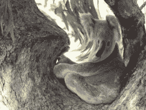

# Python 中的魔杖漩涡()功能

> 原文:[https://www . geesforgeks . org/wand-漩涡-python 中的函数/](https://www.geeksforgeeks.org/wand-swirl-function-in-python/)

**漩涡()**通过围绕图像中心旋转像素，产生一种视觉漩涡效果的扭曲图像。**内爆()**生成一种扭曲的图像，在图像中间会注意到拉扯效应。amount 参数控制向中心拉的像素范围。

> **语法:**
> 
> ```
> wand.image.swirl(degree, method)
> 
> ```
> 
> **参数:**
> 
> | 参数 | 输入类型 | 描述 |
> | --- | --- | --- |
> | 程度 | 数字。真实的 | 定义要影响的像素数量。介于-360.0 和 360.0 之间的值。
>  |
> | 方法 | 基绳 | 控制受影响像素的插值。仅适用于 ImageMagick-7。
>  |

**来源影像:**


**例 1:**

```
# Import Image from wand.image module
from wand.image import Image

# Read image using Image function
with Image(filename ="koala.jpeg") as img:

    # swirl image using swirl() function
    img.swirl(degree =-90)
    img.save(filename ="wkoala.jpeg")
```

**输出:**


**例 2:**
改变度数值

```
# Import Image from wand.image module
from wand.image import Image

# Read image using Image function
with Image(filename ="koala.jpeg") as img:
    # swirl image using swirl() function
    img.swirl(degree = 100)
    img.save(filename ="wkoala2.jpeg")
```

**输出:**
