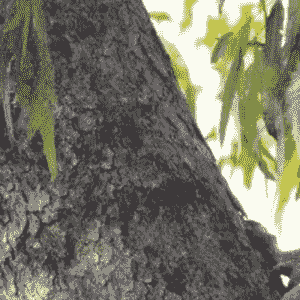

# Python 中的 Wand transform()函数

> 原文:[https://www . geesforgeks . org/wand-transform-function-in-python/](https://www.geeksforgeeks.org/wand-transform-function-in-python/)

为了同时调整和裁剪图像的大小，在魔杖中使用了**变换()**功能。首先执行裁剪操作，然后执行调整大小操作。

> **语法:** wand.image.transform(crop=，resize=)
> 
> **参数:**
> 
> | 参数 | 输入类型 | 描述 |
> | --- | --- | --- |
> | 农作物 | 基绳 | 定义要裁剪的图像子区域的几何字符串 |
> | 调整大小 | 基绳 | 定义图像最终大小的几何字符串 |

**输入图像:**


**Example #1:**

让我们拍摄一张图像，以 200×200 的尺寸裁剪它，然后重新缩放到 400×400 像素。

```py
# Import Image from wand.image module
from wand.image import Image

# Import display to display final image
from wand.display import display

# Read image using Image function
with Image(filename ='koala.jpeg') as img:

    # using transform() function
    img.transform('200x200', '200 %')

    # Saving image
    img.save(filename ='transform.jpeg')

    # display image
    display(img)
```

**输出:**


**示例#2:** 让我们拍摄一个图像裁剪所有四个角的 50 %。

```py
# Import Image from wand.image module
from wand.image import Image

# Import display to display final image
from wand.display import display

# Read image using Image function
with Image(filename ='koala.jpeg') as img:

    # using transform() function
    img.transform('50 %')

    # Saving image
    img.save(filename ='transform1.jpeg')

    # display image
    display(img)
```

**输出:**


**示例#3:** 将源图像的高度缩放至 200px 并保留纵横比。

```py
# Import Image from wand.image module
from wand.image import Image

# Import display to display final image
from wand.display import display

# Read image using Image function
with Image(filename ='koala.jpeg') as img:

    # using transform() function
    img.transform(resize ='x200')

    # Saving image
    img.save(filename ='transform3.jpeg')

    # display image
    display(img)
```

**输出:**
