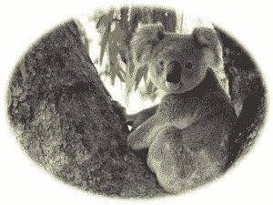
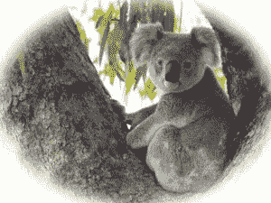

# Python 中的魔杖晕影()函数

> 原文:[https://www . geeksforgeeks . org/wand-渐晕-python 中的函数/](https://www.geeksforgeeks.org/wand-vignette-function-in-python/)

渐晕效果为图像创建了一个柔和且模糊的椭圆框架。晕影效果用于将焦点应用到我们想要的图像部分。x 和 y 参数用于控制从图像边界插入的椭圆的边缘，而半径和σ参数用于控制模糊度。如果您希望 ImageMagick 从定义的西格玛值中选择一个值，可以省略半径。

> **语法:**
> 
> ```
> wand.image.vignette(radius, sigma, x, y)
> ```
> 
> **参数:**
> 
> <figure class="table">
> 
> | 参数 | 输入类型 | 描述 |
> | --- | --- | --- |
> | 半径 | 数字。真实的 | 高斯的半径
>  |
> | 希腊字母表中第十八个字母 | 数字。真实的 | 高斯的标准偏差，以像素为单位
>  |
> | x | 数字。整数 | 椭圆的 x 边
>  |
> | y | 数字。整数 | 椭圆的 y 边
>  |
> 
> </figure>

**来源图片:**


**例 1:**

## 蟒蛇 3

```
# Import Image from wand.image module
from wand.image import Image

# Read image using Image function
with Image(filename ="koala.jpeg") as img:

    # vignette image using vignette() function
    img.vignette(sigma = 3, x = 10, y = 10)
    img.save(filename ="vkoala.jpeg")
```

**输出:**



**例 2:** 增加西格玛值

## 蟒蛇 3

```
# Import Image from wand.image module
from wand.image import Image

# Read image using Image function
with Image(filename ="koala.jpeg") as img:

    # vignette image using vignette() function
    img.vignette(sigma = 10, x = 1, y = 1)
    img.save(filename ="vkoala2.jpeg")
```

**输出:**

