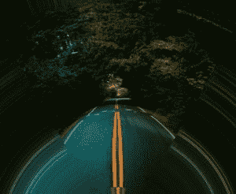
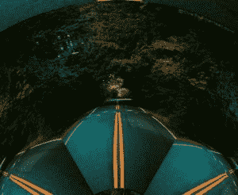

# 魔杖虚拟 _ 像素属性–Python

> 原文:[https://www . geesforgeks . org/wand-virtual _ pixel-property-python/](https://www.geeksforgeeks.org/wand-virtual_pixel-property-python/)

对光栅图像执行变形时，生成的图像通常包含原始边界光栅之外的像素。这些区域称为垂直像素，可以通过将 Image.virtual_pixel 设置为 **VIRTUAL_PIXEL_METHOD** 中定义的任何值来控制。
以下是虚拟像素方法:

<figure class="table">

| 虚拟像素法 | 描述 |
| --- | --- |
| 不明确的 | 标准默认虚拟像素方法。 |
| 背景 | 设置虚拟像素实心背景。 |
| 抖动 | 抖动会在扭曲边缘周围创建点状边缘。 |
| 边缘 | 清晰的边缘 |
| 镜子 | 镜像像素绘制在虚拟像素上，并产生镜像效果 |
| '随机' | 绘制图像中的随机像素。 |
| 瓷砖 | 将创建平铺效果。 |
| “透明” | 将虚拟像素设置为透明。 |
| '面具' | 将虚拟像素设置为空白，并创建蒙版效果。 |
| “黑色” | 设置黑色的虚拟像素。 |
| 灰色 | 设置灰色的虚拟像素。 |
| 白色 | 设置白色的虚拟像素。 |
| 水平平铺 | 仅水平设置平铺效果。 |
| “垂直 _ 平铺” | 仅垂直设置平铺效果。 |
| '水平 _ 平铺 _ 边缘' | 仅水平设置边缘清晰的平铺效果。 |
| '垂直 _ 平铺 _ 边缘' | 仅垂直设置具有不同边缘的平铺效果。 |
| “checker_tile” | 创建检查效果 |

</figure>

**语法:**

```
wand.image.virtual_pexel = 'VIRTUAL_PIXEL_METHOD'
```

**来源图片:**


**例 1:**

## 蟒蛇 3

```
from wand.color import Color
# Import Image from wand.image module
from wand.image import Image

# Read image using Image function
with Image(filename ="gog.png",  background = Color("green")) as img:

    img.virtual_pixel = 'checker_tile'
    img.distort('arc', (60, ))
    img.save(filename ='rdsv.jpg')
```

**输出:**



**示例 1:**
将 VIRTUAL_PIXEL_METHOD 更改为 tile

## 蟒蛇 3

```
# Import Image from wand.image module
from wand.image import Image

# Read image using Image function
with Image(filename ="rd.jpg") as img:
    img.virtual_pixel = 'tile'
    img.distort('arc', (60, ))
    img.save(filename ='rdsv2.jpg')
```

**输出:**

