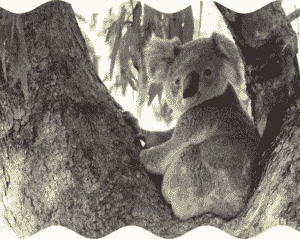
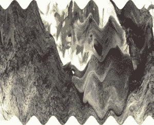

# Python 中的 Wand wave()函数

> 原文:[https://www.geeksforgeeks.org/wand-wave-function-in-python/](https://www.geeksforgeeks.org/wand-wave-function-in-python/)

wave()函数从图像的顶部和底部创建一个类似波浪的结构。在图像中产生波纹效果。我们可以使用 wave()函数中的*振幅* & *波长*参数来改变图像的波长和振幅。

> **语法:**
> 
> ```
> wand.image.wave(amplitude, wave_legth)
> 
> ```
> 
> **参数:**
> 
> | 参数 | 输入类型 | 描述 |
> | --- | --- | --- |
> | 振幅 | 数字。整数 | 设置波的振幅。
>  |
> | 波长 | 数字。整数 | 设置波长。
>  |

**来源影像:**


**例 1:**

```
# Import Image from wand.image module
from wand.image import Image

# Read image using Image function
with Image(filename ="koala.jpeg") as img:

    # rippled image using vignette() function
    img.wave(amplitude = img.height / 32,
             wave_length = img.width / 4)
    img.save(filename ="wkoala2.jpeg")
```

**输出:**


**例 2:** 振幅增大，波长减小。

```
# Import Image from wand.image module
from wand.image import Image

# Read image using Image function
with Image(filename ="koala.jpeg") as img:

    # rippled image using vignette() function
    img.wave(amplitude = img.height / 24,
             wave_length = img.width / 8)
    img.save(filename ="wkoala2.jpeg")
```

**输出:**
