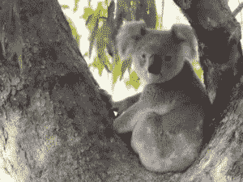
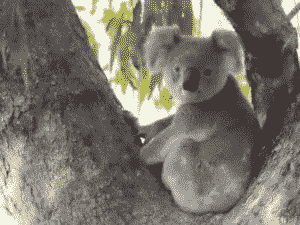

# Python 中的 Wand 小波 _ 去噪()函数

> 原文:[https://www . geesforgeks . org/wand-小波 _ 降噪-python 中的函数/](https://www.geeksforgeeks.org/wand-wavelet_denoise-function-in-python/)

此方法与使用软化()函数从图像中去除噪声相同。但是这种方法通过应用小波变换来去除噪声，这种方法更加方便和有效。阈值参数应该是介于 0.0 和 quantum _ range
之间的值

> **语法:**
> 
> ```
> wand.image.wave_denoise(threshold, softness)
> ```
> 
> **参数:**
> 
> <figure class="table">
> 
> | 参数 | 输入类型 | 描述 |
> | --- | --- | --- |
> | 阈值 | 数字。断裂 | 0.0 和 quantum_range 之间的值 |
> | 温柔 | 数字。真实的 | 对图像应用柔和度 |
> 
> </figure>

**来源图片:**


**例 1:**

## 蟒蛇 3

```
# Import Image from wand.image module
from wand.image import Image

# Read image using Image function
with Image(filename ="koala.jpeg") as img:

    # denoise image using wave_denoise() function
    img.wavelet_denoise(threshold = 0.05 * img.quantum_range,
                        softness = 0.0)
    img.save(filename ="vkoala.jpeg")
```

**输出:**



**例 2:** 增加阈值

## 蟒蛇 3

```
# Import Image from wand.image module
from wand.image import Image

# Read image using Image function
with Image(filename ="koala.jpeg") as img:

    # vignette image using vignette() function
    img.wavelet_denoise(threshold = 0.065 * img.quantum_range,
                        softness = 0.00)
    img.save(filename ="vkoala2.jpeg")
```

**输出:**

