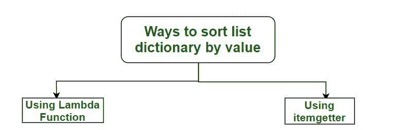

# 在 Python 中按值对字典列表进行排序的方法–使用 lambda 函数

> 原文:[https://www . geesforgeks . org/way-sort-list-dictionary-values-python-using-lambda-function/](https://www.geeksforgeeks.org/ways-sort-list-dictionaries-values-python-using-lambda-function/)

排序在日常编程中一直是一个有用的工具。Python 中的字典广泛应用于从竞争领域到开发人员领域的许多应用程序中(例如处理 JSON 数据)。在这种情况下，拥有根据字典的值对字典进行排序的知识会很有用。
实现这种排序有 2 种方式:



1.) **<u>使用λ函数:-</u>**

本文讨论使用 lambda 函数和使用“ **sorted()** ”内置函数进行排序。各种各样的变化也可以实现分类字典。

*   **降序:**除了排序()功能外，使用“**反转=真**”。
*   **用于对 w.r.t 多个值进行排序:**用“**逗号**分隔，指出排序的正确顺序。

## 计算机编程语言

```
# Python code demonstrate the working of
# sorted() with lambda

# Initializing list of dictionaries
lis = [{ "name" : "Nandini", "age" : 20},
{ "name" : "Manjeet", "age" : 20 },
{ "name" : "Nikhil" , "age" : 19 }]

# using sorted and lambda to print list sorted
# by age
print "The list printed sorting by age: "
print sorted(lis, key = lambda i: i['age'])

print ("\r")

# using sorted and lambda to print list sorted
# by both age and name. Notice that "Manjeet"
# now comes before "Nandini"
print "The list printed sorting by age and name: "
print sorted(lis, key = lambda i: (i['age'], i['name']))

print ("\r")

# using sorted and lambda to print list sorted
# by age in descending order
print "The list printed sorting by age in descending order: "
print sorted(lis, key = lambda i: i['age'],reverse=True)
```

输出:

```
The list printed sorting by age: 
[{'age': 19, 'name': 'Nikhil'}, {'age': 20, 'name': 'Nandini'}, {'age': 20, 'name': 'Manjeet'}]

The list printed sorting by age and name: 
[{'age': 19, 'name': 'Nikhil'}, {'age': 20, 'name': 'Manjeet'}, {'age': 20, 'name': 'Nandini'}]

The list printed sorting by age in descending order: 
[{'age': 20, 'name': 'Nandini'}, {'age': 20, 'name': 'Manjeet'}, {'age': 19, 'name': 'Nikhil'}]

```

**下一篇文章->**Python 中按值对字典列表进行排序的方法–使用 itemgetter
本文由**曼吉特·辛格**供稿。如果你喜欢 GeeksforGeeks 并想投稿，你也可以使用[contribute.geeksforgeeks.org](http://www.contribute.geeksforgeeks.org)写一篇文章或者把你的文章邮寄到 contribute@geeksforgeeks.org。看到你的文章出现在极客博客主页上，帮助其他极客。
如果发现有不正确的地方，或者想分享更多关于上述话题的信息，请写评论。