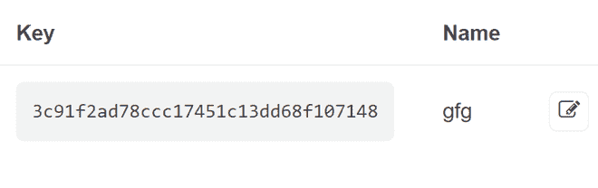
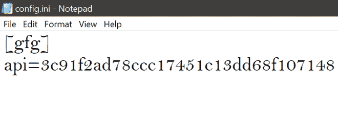

# 使用 Tkinter 模块的 Python 天气应用

> 原文:[https://www . geesforgeks . org/weather-app-in-python-using-tkinter-module/](https://www.geeksforgeeks.org/weather-app-in-python-using-tkinter-module/)

在本文中，我们将讨论如何使用 *tkinter* 创建天气应用程序。图形用户界面应用程序将告诉我们特定城市的当前天气，以及温度和其他细节。

### **所需模块:**

*   **Tkinter:** 是一个内置的 python 库，用于使用 *tkinter* 工具包制作 GUI。
*   **请求:**是一个借助 URL 帮助获取数据的库。可以使用以下命令安装:

```
pip install requests
```

### 方法:

首先，我们必须使用一个天气应用编程接口，通过生成一个应用编程接口密钥从[开放天气地图](https://openweathermap.org/)网站获取数据，然后我们需要创建一个配置文件来存储密钥。最后在 python 脚本中使用该配置文件。

### 生成应用编程接口密钥的步骤:

*   登录[打开天气图](https://openweathermap.org/)
*   转到 *API* 部分。然后在*当前天气数据*部分点击*空气污染指数文档*。
*   现在在 *API 调用*部分，我们有*api.openweathermap.org/data/2.5/weather?q={city 名称} & appid={API 密钥}* 的链接
*   点击链接上的 *API 键*，它将指向您可以获取该键的页面。生成的密钥如下所示:



### 创建配置文件的步骤:

*   创建名为 config.ini 的文件。
*   在这里写下括在方括号内的键名**【gfg】*。*
*   *创建一个可变键(此处为*键*)并粘贴复制的键，如下图所示:*

**

### *创建 Python 脚本的步骤:*

*   *导入模块。*

## *蟒蛇 3*

```
*# import required modules
from configparser import ConfigParser
import requests
from tkinter import *
from tkinter import messagebox*
```

*   *我们首先要借助 *tkinter* 制作 GUI 的主体。*

## *蟒蛇 3*

```
*# create object
app = Tk()

# add title
app.title("Weather App")

# adjust window size
app.geometry("300x300")

# add labels, buttons and text
city_text = StringVar()
city_entry = Entry(app, textvariable=city_text)
city_entry.pack()

Search_btn = Button(app, text="Search Weather",
                    width=12, command=search)
Search_btn.pack()

location_lbl = Label(app, text="Location", 
                     font={'bold', 20})
location_lbl.pack()

temperature_label = Label(app, text="")
temperature_label.pack()

weather_l = Label(app, text="")
weather_l.pack()

app.mainloop()*
```

*   *读取 config.ini 文件，然后在程序中加载密钥和 URL。*

## *蟒蛇 3*

```
*# extract key from the 
# configuration file
config_file = "config.ini"
config = ConfigParser()
config.read(config_file)
api_key = config['gfg']['api']
url = 'http://api.openweathermap.org/data/2.5/weather?q={}&appid={}'*
```

*   *使用 *getweather()* 函数获取特定位置的天气。*

## *蟒蛇 3*

```
*# explicit function to get
# weather details
def getweather(city):
    result = requests.get(url.format(city, api_key))

    if result:
        json = result.json()
        city = json['name']
        country = json['sys']
        temp_kelvin = json['main']['temp']
        temp_celsius = temp_kelvin-273.15
        weather1 = json['weather'][0]['main']
        final = [city, country, temp_kelvin, 
                 temp_celsius, weather1]
        return final
    else:
        print("NO Content Found")*
```

*   *搜索功能，这样我们就可以得到输出的天气详情。*

## *蟒蛇 3*

```
*# explicit function to
# search city
def search():
    city = city_text.get()
    weather = getweather(city)

    if weather:
        location_lbl['text'] = '{} ,{}'.format(weather[0], weather[1])
        temperature_label['text'] = str(weather[3])+"   Degree Celsius"
        weather_l['text'] = weather[4]

    else:
        messagebox.showerror('Error', "Cannot find {}".format(city))*
```

***下面是完整的程序:***

## *蟒蛇 3*

```
*# import required modules
from configparser import ConfigParser
import requests
from tkinter import *
from tkinter import messagebox

# extract key from the
# configuration file
config_file = "config.ini"
config = ConfigParser()
config.read(config_file)
api_key = config['gfg']['api']
url = 'http://api.openweathermap.org/data/2.5/weather?q={}&appid={}'

# explicit function to get
# weather details
def getweather(city):
    result = requests.get(url.format(city, api_key))

    if result:
        json = result.json()
        city = json['name']
        country = json['sys']
        temp_kelvin = json['main']['temp']
        temp_celsius = temp_kelvin-273.15
        weather1 = json['weather'][0]['main']
        final = [city, country, temp_kelvin, 
                 temp_celsius, weather1]
        return final
    else:
        print("NO Content Found")

# explicit function to
# search city
def search():
    city = city_text.get()
    weather = getweather(city)
    if weather:
        location_lbl['text'] = '{} ,{}'.format(weather[0], weather[1])
        temperature_label['text'] = str(weather[3])+"   Degree Celsius"
        weather_l['text'] = weather[4]
    else:
        messagebox.showerror('Error', "Cannot find {}".format(city))

# Driver Code
# create object
app = Tk()
# add title
app.title("Weather App")
# adjust window size
app.geometry("300x300")

# add labels, buttons and text
city_text = StringVar()
city_entry = Entry(app, textvariable=city_text)
city_entry.pack()
Search_btn = Button(app, text="Search Weather", 
                    width=12, command=search)
Search_btn.pack()
location_lbl = Label(app, text="Location", font={'bold', 20})
location_lbl.pack()
temperature_label = Label(app, text="")
temperature_label.pack()
weather_l = Label(app, text="")
weather_l.pack()
app.mainloop()*
```

***输出:***

*<video class="wp-video-shortcode" id="video-541802-1" width="640" height="360" preload="metadata" controls=""><source type="video/mp4" src="https://media.geeksforgeeks.org/wp-content/uploads/20210107195919/Last.mp4?_=1">[https://media.geeksforgeeks.org/wp-content/uploads/20210107195919/Last.mp4](https://media.geeksforgeeks.org/wp-content/uploads/20210107195919/Last.mp4)</video>*